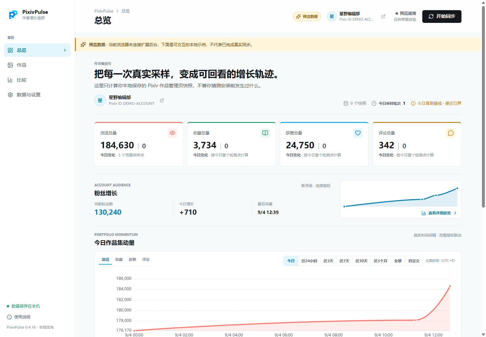
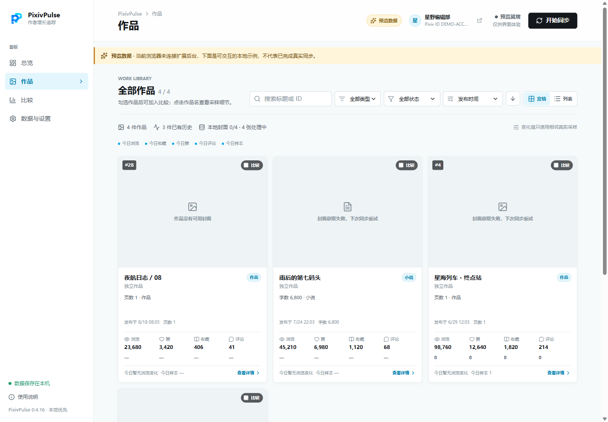

<div align="center">
  

# PixivPulse

**让每一次真实采样，都成为可回看的创作增长轨迹。**

一个面向 Pixiv 作者的本地优先增长分析扩展。<br />
在浏览器内追踪全部作品的浏览、收藏、获赞、评论、排名与粉丝变化。

[下载最新版](https://github.com/Zenith-Angle/PixivPulse/releases/latest) · [安装指南](#安装) · [功能概览](#你会得到什么) · [数据与隐私](#数据与隐私) · [参与开发](#从源码构建) · [更新日志](./CHANGELOG.md)

[](https://github.com/Zenith-Angle/PixivPulse/releases/latest)
[](#安装)
[](https://developer.chrome.com/docs/extensions/develop/migrate/what-is-mv3)
[](https://www.typescriptlang.org/)
[](#质量与验证)
[](./LICENSE)

</div>

> [!IMPORTANT]
> PixivPulse 使用你当前浏览器中已登录的 Pixiv 会话，只进行读取和本地分析。它不会点赞、收藏、关注、评论、投稿或修改作品，也不提供独立登录，不上传 Cookie、作品数据或分析结果。



<p align="center"><sub>内置预览数据 · 不包含真实 Pixiv 账号或作品</sub></p>

## 为什么是 PixivPulse

Pixiv 的作品管理页擅长展示当前数字，却很难回答作者更关心的连续问题：今天究竟增长了多少，哪件作品正在加速，收藏转化是否改善，一段时间后还能不能回看当时发生了什么。

PixivPulse 把每轮只读观察保存为本地时间序列，并让总览、作品库、对比、排名和洞察共享同一套北京时间口径。第一次同步建立基线，之后每一次成功采样都让趋势更清晰。

| | PixivPulse 的选择 |
| --- | --- |
| **全部作品，而非少量近期投稿** | 串行读取作者自己的插画、漫画与小说管理数据，统一进入作品库。 |
| **增长，而非只有累计值** | 记录观察批次与指标快照，区分“没有变化”和“没有采样”。 |
| **本地优先** | IndexedDB 保存作品、历史、运行记录与封面；分析不经过第三方服务。 |
| **统一时间语义** | “今日”固定为北京时间自然日，“近 24 小时”保留为独立滚动范围。 |
| **克制的自动化** | 固定北京时间刻度执行，手动同步不改变时刻表，失败后不密集重试或补跑。 |
| **可带走的数据** | JSON / CSV 导出、导入预览、账号一致性检查与 SHA-256 完整性校验。 |

## 你会得到什么

### 一眼读懂创作组合

- 浏览、收藏、获赞、评论四项总量与所选时间范围增量；
- 粉丝增长、作品集动量、Pixiv 排名和规则型洞察；
- 今日、近 24 小时、近 3 / 7 / 30 天、近 3 个月、全部与自定义范围；
- 真实时间轴、缩放、密集点降采样和范围联动。

### 找到正在变化的作品

- 宫格 / 列表双视图、关键字搜索、多维排序与正逆序切换；
- 单作详情中的完整指标曲线、采样质量与最近变化；
- 最多五件作品并排比较，可切换绝对值与增长值；
- 在 Pixiv 作品管理页直接显示当天浏览、赞、收藏与评论增长条。



### 让历史可恢复

- JSON 与防公式注入 CSV 均可导出、预览并合并导入；
- 缩略图使用独立本地缓存，导入后可按源地址重新建立；
- 历史跨过完整保留窗口前，先写出可导入备份并完成回读与哈希校验；
- 事务内复验失败、目录失权或数据竞争时，保留原始记录并暂停有损整理。

## 安装

当前稳定版是 **v0.4.19**，要求 **Chrome 120 或更高版本**。项目尚未上架 Chrome Web Store，需要以已解压扩展方式安装。

1. 从 [GitHub Releases](https://github.com/Zenith-Angle/PixivPulse/releases/latest) 下载 `pixiv-pulse-v0.4.19-chrome.zip` 和 `SHA256SUMS.txt`。
2. 可选但推荐：核对 ZIP 的 SHA-256。

   ```powershell
   Get-FileHash .\pixiv-pulse-v0.4.19-chrome.zip -Algorithm SHA256
   ```

3. 将 ZIP 完整解压到一个不会被清理的目录。
4. 在 Chrome 打开 `chrome://extensions`，开启右上角的“开发者模式”。
5. 点击“加载已解压的扩展程序”，选择刚刚解压的目录。
6. 登录 Pixiv，点击工具栏中的 PixivPulse 图标，执行第一次同步以建立本地基线。

> [!NOTE]
> 升级时先备份重要数据。解压新版本后，在扩展管理页对原扩展执行刷新；不要直接选择 ZIP，也不要把 `.output`、版本 ZIP 或临时目录当作日常安装源。

## 同步如何工作

```text
当前 Chrome 的 Pixiv 登录会话
              │
              ▼
   作者账号 / 插画 / 小说只读数据
              │  串行、限速、遇阻即停
              ▼
       完整轮次暂存与一致性检查
              │  仅完整成功后提交
              ▼
 IndexedDB 快照 ──► 本地图表、对比与洞察
              │
              └──► JSON / CSV / 抽稀前备份
```

自动同步默认每 1 小时，可调整为每 30 分钟或更长间隔。时刻表对齐北京时间固定刻度，例如 30 分钟模式依次运行于 `00:00`、`00:30`、`01:00`；手动同步不会把下一次自动同步向后推移。

后台读取失败时，扩展可以打开一个临时 Pixiv 作品管理标签页并在完成后关闭。遇到人机验证、限流、会话失效或页面结构变化时会立即停止并进入冷却；浏览器关闭或设备休眠期间不会采集，恢复后最多处理一次待执行时段，不会产生追赶式请求。

## 数据与隐私

| 数据 / 能力 | 用途 | 离开设备？ |
| --- | --- | :---: |
| 作品指标、粉丝样本、同步记录 | 生成历史、对比与洞察 | 否 |
| 作品缩略图 | 本地作品库与详情展示 | 仅从 Pixiv CDN 读取 |
| `storage` / `unlimitedStorage` | 保存本地历史与设置 | 否 |
| `alarms` | 驱动固定时刻自动同步与低频修复 | 否 |
| `www.pixiv.net` 主机权限 | 使用当前会话读取作者自己的管理数据 | 请求 Pixiv |
| `i.pximg.net` 主机权限 | 获取作品缩略图并写入本地缓存 | 请求 Pixiv CDN |

- 不含遥测、广告、第三方分析、远程脚本或 PixivPulse 云端账号。
- 设置和可恢复同步状态保存在 `chrome.storage.local`；业务数据保存在扩展自己的 IndexedDB。
- 近 3 天变化点完整保留；3–7 天保留到每 30 分钟，7–30 天保留到每 1 小时，30 天以上保留到每 6 小时。
- 抽稀前备份目录由你明确授权；建议在个人文档目录中建立 `PixivPulseBackups` 文件夹。
- 导出文件是明文且不加密；SHA-256 用于发现损坏或意外修改，不等同于加密保护。
- 卸载扩展会删除浏览器保存的本地数据。需要长期保留时，请先导出 JSON 备份。

## 已知边界

1. 第一次同步只能建立基线，无法倒推出安装前的每日增长。
2. “浏览量”来自 Pixiv 作品管理页，不等同于 Pixiv Premium“流量分析”中的详情页浏览量。
3. Pixiv 没有为此用途提供稳定的公开 API；站点接口或页面结构变化后，解析器可能需要更新。
4. 浏览器关闭、设备休眠或扩展后台未运行时不会采集，因而图表只代表实际完成的观察。
5. 缩略图来自 `i.pximg.net`，网络失败时会显示本地占位图。
6. 任何自动化访问都可能受到站点规则、限流或风控调整影响；请根据自己的账号与使用环境谨慎设置频率。
7. 单轮同步设置了 10,000 件作品、200 个分页区间、单响应大小与超时等安全上限；超大作品库触及上限时会停止，而不会把不完整结果提交为成功快照。

## 从源码构建

需要 Node.js 22+、npm 与 Chrome 120+。

```powershell
git clone https://github.com/Zenith-Angle/PixivPulse.git
cd PixivPulse
npm ci
npm run verify
```

常用命令：

| 命令 | 作用 |
| --- | --- |
| `npm run dev` | 构建固定开发目录 `.extension-dev/chrome-mv3` 并校验安装产物 |
| `npm run typecheck` | 运行 TypeScript 静态检查 |
| `npm test` | 运行 Vitest 测试套件 |
| `npm run build` | 生成 Chrome MV3 生产构建 |
| `npm run zip` | 生成可发布 ZIP |
| `npm run verify` | 顺序执行类型检查、测试、生产构建、ZIP 与固定开发构建 |

开发时只把 `.extension-dev/chrome-mv3` 加载为已解压扩展。这个目录使用固定扩展身份且完全自包含，不依赖开发服务器；每次构建后在 `chrome://extensions` 刷新即可。

## 项目结构

```text
PixivPulse/
├─ entrypoints/        # MV3 后台、Dashboard、Popup 与 Pixiv 页面脚本
├─ src/
│  ├─ data/            # IndexedDB、备份、导入、帧存储与同步状态机
│  ├─ domain/          # 时间、指标、解析、策略与纯业务规则
│  ├─ media/           # 封面下载队列、缓存数据库与恢复逻辑
│  └─ ui/              # React 界面、图表、作品分析与预览数据
├─ tests/              # Pixiv 页面解析与内容脚本测试
├─ scripts/            # 图标生成、安装构建校验与本地数据维护工具
├─ public/             # 扩展图标
└─ wxt.config.ts       # WXT / Manifest V3 配置
```

## 质量与验证

项目使用 TypeScript、Vitest、Testing Library、JSDOM 与 fake-indexeddb 覆盖核心路径，包括：

- Pixiv 页面解析、账号绑定、同步分页与失败分类；
- 北京时间日界、固定时刻调度、恢复与重复时段抑制；
- 快照、观察批次、紧凑帧、时间抽稀与事务安全；
- JSON / CSV 校验、导入预览、账号冲突与合并提交；
- 封面队列、容量门禁、缓存恢复与 UI 数据流；
- 总览、作品库、比较、Popup、图表选项与响应式呈现。

发布前的标准门禁是：

```powershell
npm run verify
```

## 参与项目

欢迎通过 [Issues](https://github.com/Zenith-Angle/PixivPulse/issues) 提交可复现的问题、Pixiv 页面结构变化或改进建议。请勿在 Issue、日志或截图中附带 Cookie、授权头、完整账号导出或其他敏感信息。

提交代码前请确保 `npm run verify` 通过，并让改动保持在清晰、可审查的范围内。

## 许可证与声明

PixivPulse 以 [MIT License](./LICENSE) 开源。运行时依赖的版权与许可证见 [Third-Party Notices](./THIRD_PARTY_NOTICES.md)；构建脚本也会把相应许可证文本放入发布包。

Pixiv、pixiv 标识及相关服务归 pixiv Inc. 所有。PixivPulse 是独立开发项目，与 pixiv Inc. 无隶属、授权、背书或官方合作关系。

<div align="center">
  <sub>Built for creators who want their own data to remain useful, understandable, and local.</sub>
</div>
