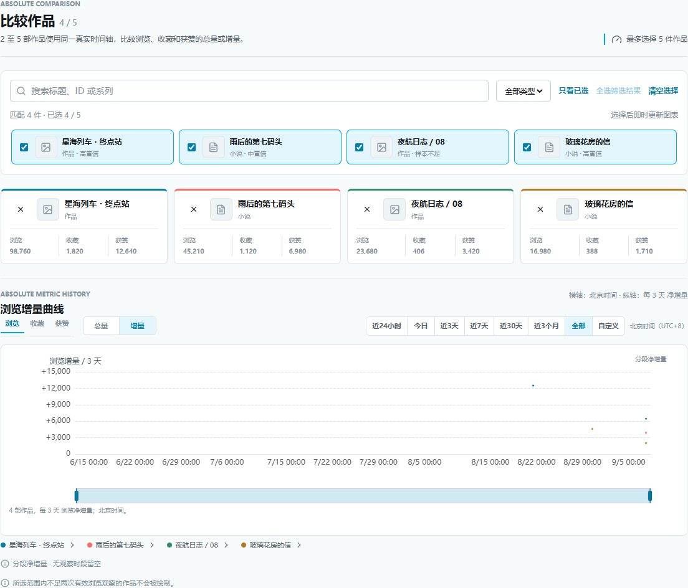

<div align="center">
  

# PixivPulse

**看清作品的增长，也看清增长发生的过程。**

面向 Pixiv 作者的本地优先浏览器扩展。<br />
追踪浏览、收藏、获赞、评论与粉丝变化，用真实采样连接每一次创作反馈。

[下载最新版](https://github.com/Zenith-Angle/PixivPulse/releases/latest) · [安装与升级](#安装与升级) · [功能预览](#功能预览) · [Agent 使用指南](./docs/agent-guide.zh-CN.md) · [更新日志](./CHANGELOG.md)

[](https://github.com/Zenith-Angle/PixivPulse/releases/latest)
[](#安装与升级)
[](./wxt.config.ts)
[](./LICENSE)

</div>

PixivPulse 将作者自己的作品管理数据保存为本地历史，让你能够回答：今天哪些作品在增长？增长正在加快还是放缓？几件作品在同一时段的表现有什么不同？

无需配置模型即可使用全部本地看板功能。需要进一步讨论数据或小说内容时，可以另外接入自己的模型 API，启用可选的 Agent 分析。

> 看板统计在本地完成。Pixiv 访问使用当前浏览器登录会话，不执行点赞、收藏、关注、评论或投稿。Agent 对话会发往你配置的 API；作品数据分享与小说正文采样分别需要开启。

## 功能预览

### 总量与增量，一起看

总览和单作详情同时展示累计曲线与分段增量。切换浏览、收藏、获赞、评论或时间范围，两张图随之更新；长区间的总量曲线保留阶段性加速、减速，提示数值仍来自原始采样。


### 从作品库快速找到变化

作品库支持宫格、列表、搜索、类型筛选和多维排序。每件作品都有今日浏览增量小图，点击即可打开详情；今日变化、累计指标、采样数量和排名可一并查看。

<details>
<summary>查看作品库截图</summary>


</details>

### 比较集中操作，不来回切页面

在比较页选择 2–5 件作品，用同一时间轴对照浏览、收藏和获赞的总量或增量。可搜索标题、ID、系列，筛选类型、只看已选、批量加入、逐件移除或清空；作品页不再显示比较复选框。



以上截图均来自内置预览数据，不代表真实账号的表现。样本不足时明确显示等待状态，不生成虚构曲线。

| 还可以做什么 | 使用方式 |
| --- | --- |
| 查看粉丝与排名 | 在总览查看账号粉丝历史、作品排名及规则型洞察。 |
| 持续记录 | 默认每小时同步；也可设置为每 30 分钟、更长间隔或仅手动。 |
| 在 Pixiv 页面查看变化 | 作品管理页可显示当天浏览、收藏、获赞与评论增长提示。 |
| 备份与恢复 | 导出 JSON / CSV，导入时预览内容、检查账号与完整性，再合并数据。 |
| 与 Agent 讨论 | 按需查询本地统计、比较作品，或授权采样小说正文进行分析。 |

## 安装与升级

当前版本：**v0.5.11**。需要 **Chrome 120+**，通过已解压扩展安装。

### 首次安装

1. 在 [最新 Release](https://github.com/Zenith-Angle/PixivPulse/releases/latest) 下载 `pixiv-pulse-v0.5.11-chrome.zip`。请选择这个安装包，GitHub 自动生成的 **Source code** 是源码包。
2. 将 ZIP 完整解压到准备长期保留的目录，确认目录内有 `manifest.json`。
3. 打开 Chrome 扩展管理页 `chrome://extensions`，开启“开发者模式”。
4. 点击“加载已解压的扩展程序”，选择包含 `manifest.json` 的目录。
5. 在同一浏览器登录 Pixiv，点击 PixivPulse 扩展图标并执行第一次同步。

第一次同步建立基线。后续观察才会形成可比较的变化；不需要 API key 就能使用图表和统计。

<details>
<summary>可选：校验安装包完整性</summary>

下载同一 Release 的 `SHA256SUMS.txt`，在 PowerShell 计算 ZIP 的哈希，与文件中的值比较：

```powershell
Get-FileHash .\pixiv-pulse-v0.5.11-chrome.zip -Algorithm SHA256
```

</details>

### 更新已有安装

先导出重要数据备份，再将新版解压内容更新到**原安装目录**。在扩展管理页刷新原有 PixivPulse，然后关闭旧看板并重新打开。无需卸载扩展；卸载会删除浏览器中的本地数据。

## 如何理解这些数据

| 图表口径 | 含义 |
| --- | --- |
| 今日 | 北京时间 00:00 至当前时刻；不同于滚动的近 24 小时。 |
| 累计曲线 | 表示当时记录的指标总数；平滑只影响显示，不改写采样值。 |
| 分段增量 | 将相邻有效观察的差额计入观察结束所在时段，分段大小随所选范围调整。 |
| 空白与零 | 空白表示没有可计算的观察；零表示确实观察到没有净变化。负值表示回落。 |
| 跨间隔变化 | 两次采样之间间隔较长时，不能据此判断变化具体发生在哪一刻。 |
| 作品集总量 | 新纳入作品的初始数据也可能抬高总量，因此总量差额不一定全是已有作品的新增长。 |

图表提供今日、近 24 小时、近 3 / 7 / 30 天、近 3 个月、全部和自定义范围。没有安装前的历史，也无法补回设备未采集期间的逐时变化。

自动同步按北京时间固定刻度运行，手动同步不改变后续时刻表。浏览器关闭或设备休眠时不会采集；恢复后不会密集补跑。遇到登录失效、限流或页面变化会停止并显示状态。后台读取失败时，可能通过临时 Pixiv 管理页完成采集。

## 可选的 Agent 分析

在 **Agent 分析 → 连接配置** 填写自己的 API 地址、模型与密钥，选择是否允许查询本地数据，再执行“测试连接与工具调用”。支持 Responses 与 Chat Completions 两种协议。

可以从这些问题开始：

- “最近 7 天哪些作品增长最快？说明采样范围和证据。”
- “比较这几部作品的收藏转化，区分累计表现与近期变化。”
- “根据实际读到的片段，给出人物关系与叙事节奏的修改建议。”

回答支持连续追问、来源展开、流式输出、停止、重新生成和 Markdown 导出。小说内容分析需另外开启正文采样；采样有范围限制，模型回答也需要对照来源判断。

详细配置、采样深度、预算与隐私见 [Agent 使用指南](./docs/agent-guide.zh-CN.md)。实现原理与排错见 [Agent 构建教程](./docs/agent-building-tutorial.zh-CN.md)。

## 数据与隐私

完整的数据处理、第三方 AI 服务及删除说明见 [隐私政策](./PRIVACY.md)。

| 数据 | 保存与发送方式 |
| --- | --- |
| 作品历史、粉丝数据、同步记录 | 保存在扩展本地；启用 Agent 数据分享后，按问题发送所需查询结果。 |
| Agent 对话 | 发往所选 API，并在本地按账号保存；与作品备份分开管理。 |
| 小说正文 | 需单独开启采样；实际读取的文本可能发送至所选 API，短篇可能覆盖全文。 |
| API key | 默认仅留在当前标签页会话；选择记住后在本机未加密保存。不会进入作品备份或对话 Markdown 导出。 |
| 封面 | 从 Pixiv CDN 获取，并缓存在本地；失败时使用占位图。 |

项目不包含遥测、广告、远程执行脚本或 PixivPulse 云端账号。访问 Pixiv 和封面 CDN 仍会产生正常网络请求；使用 Agent 时，所选模型服务可能计费，其数据处理规则由该服务决定。

历史按时间逐级抽稀，以减少本地占用。有损整理前需要已授权的备份目录，并完成备份回读与完整性校验；条件不满足时保留原始记录。导出文件为明文，SHA-256 用于校验完整性，不提供加密。

请注意：浏览量取自作品管理页，不等同于 Pixiv Premium 流量分析；站点接口变化可能需要更新扩展，自动访问也可能遇到站点限制。

## 开发与文档

使用满足项目依赖要求的 Node.js 22 LTS（22.13+）或 Node.js 24 LTS，以及 npm。

```powershell
git clone https://github.com/Zenith-Angle/PixivPulse.git
cd PixivPulse
npm ci
npm run verify
```

| 命令 | 结果 |
| --- | --- |
| `npm run dev` | 构建并校验固定加载目录 `.extension-dev/chrome-mv3`，不启动热更新服务器。 |
| `npm run typecheck` | TypeScript 检查。 |
| `npm test` | 运行测试。 |
| `npm run build` | 生成 `.output/chrome-mv3` 生产构建。 |
| `npm run zip` | 生成发行 ZIP。 |
| `npm run verify` | 依次执行类型检查、测试、生产构建、ZIP 和固定目录构建校验。 |

开发时加载 `.extension-dev/chrome-mv3`，构建后在 Chrome 扩展管理页刷新。该目录使用固定扩展身份，资源完全在本地，不依赖开发服务器。

项目使用 WXT、React、TypeScript、ECharts 和 IndexedDB。`entrypoints/` 负责扩展入口，`src/domain/` 负责业务规则，`src/data/` 与 `src/media/` 管理存储和封面，`src/ui/` 提供看板，`src/agent/` 提供模型协议及分析工具。

- [Agent 使用指南](./docs/agent-guide.zh-CN.md)：连接、授权、采样与常见问题。
- [Agent 构建与排错教程](./docs/agent-building-tutorial.zh-CN.md)：协议、工具循环、预算、会话和验收。
- [完整更新日志](./CHANGELOG.md)：按版本查看变化。
- [第三方许可证](./THIRD_PARTY_NOTICES.md)：运行时依赖的版权与许可。

欢迎通过 [Issues](https://github.com/Zenith-Angle/PixivPulse/issues) 提交问题或建议。报告问题时请附扩展版本、操作步骤与脱敏错误，勿附带 Cookie、API key 或个人完整备份。

## 许可证

[MIT](./LICENSE)。PixivPulse 是独立开发项目，与 pixiv Inc. 无隶属、背书或官方合作关系。
