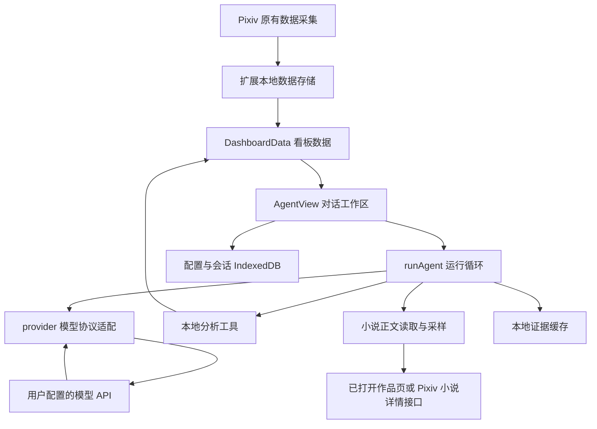
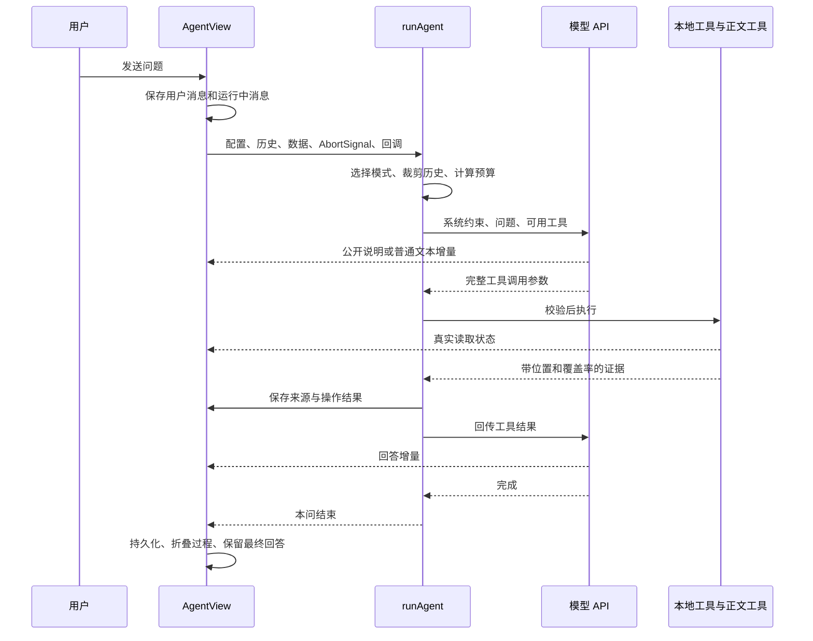
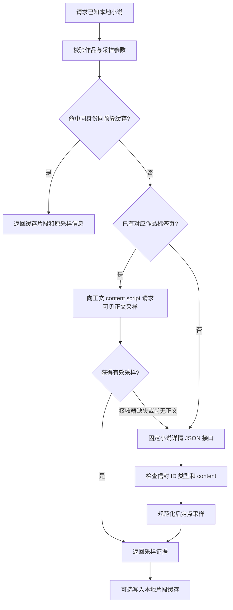

# 从数据看板到可用的 Agent：PixivPulse 构建与排错教程

> 文档版本：1.0.0 · 编写日期：2026-09-08
>
> 讲解基线：PixivPulse **0.5.10**，代码提交 **`7d5c965`**。
>
> 适合读者：会一些 JavaScript / TypeScript，希望理解一个真实 Agent 产品如何接入模型、查询数据、阅读原文、管理对话并逐步修复问题的人。

这份文档不是功能宣传页，也不是从零复制粘贴就能运行的独立工程。它以已经存在的项目为教材，解释“为什么这样设计”“代码怎样实现”“哪些尝试失败了”“后来如何验证”。代码块标注为**教学伪代码**时，只展示核心结构；未标注为原样摘录的片段不应当直接替换生产代码。

当前实现以源码为准；历史过程以 `CHANGELOG.md`、三份验收记录和本次对话中的用户反馈为依据。版本记录不等于每个版本都各有独立 Git 提交，更不等于每一版都发布过远程 Release。文档覆盖有记录的主要功能与问题，不声称能够还原未记录的每次试验。

所有示例作品、数字和场景均为教学构造，除明确标记的历史测试统计外，不使用个人投稿正文、真实密钥或个人经营数据。

## 阅读路线

- **先理解系统**：第 1–4 章，认识 Agent、浏览器环境和完整执行链路。
- **理解核心实现**：第 5–10 章，连接配置、协议、工具、知识与预算。
- **理解正文与交互**：第 11–16 章，采样、网络、流式输出、会话、预设与安全。
- **学习如何排错**：第 17–19 章，逐项复盘问题、验证方法与当前边界。
- **自己动手扩展**：第 20–23 章，实验、开发步骤、术语和源码索引。

| 系统与核心 | 正文与交互 | 排错与实践 |
| --- | --- | --- |
| [1. Agent 是什么](#chapter-1) | [9. 执行循环](#chapter-9) | [17. 逐项问题复盘](#chapter-17) |
| [2. 运行环境](#chapter-2) | [10. 输入预算](#chapter-10) | [18. 验收方法](#chapter-18) |
| [3. 完整请求](#chapter-3) | [11. 正文采样](#chapter-11) | [19. 当前边界](#chapter-19) |
| [4. 数据模型](#chapter-4) | [12. 网络与冷却](#chapter-12) | [20. 从零学习顺序](#chapter-20) |
| [5. 连接配置](#chapter-5) | [13. 轻量记忆](#chapter-13) | [21. 十个实验](#chapter-21) |
| [6. 协议适配](#chapter-6) | [14. 流式交互](#chapter-14) | [22. 扩展新工具](#chapter-22) |
| [7. 全部工具](#chapter-7) | [15. 会话与 UI](#chapter-15) | [23. 源码与术语](#chapter-23) |
| [8. 统计口径](#chapter-8) | [16. 预设与安全](#chapter-16) | |

<a id="chapter-1"></a>
## 1. 首先说清楚：这个 Agent 到底是什么

### 1.1 一次普通模型请求与一次 Agent 任务的区别

普通聊天调用通常是：用户发送问题，应用把问题交给模型，模型返回文本。假如模型没有收到作品数据，它并不知道作者当前有多少篇投稿，也不能凭空知道哪篇最近增长最快。

PixivPulse 增加了一层**由应用控制的工具执行循环**：

1. 应用告诉模型有哪些工具，以及每个工具接受什么参数。
2. 模型根据问题提出工具调用请求。
3. 应用验证请求，实际查询本地数据或读取允许的小说正文。
4. 应用把结果送回模型。
5. 模型继续提问工具，或者根据证据形成回答。

这里最关键的分工是：**模型选择动作并解释证据，应用负责权限、计算、执行和停止条件。**模型输出一个工具名称，并不代表它真的执行过那个动作。

这种“提出调用—应用执行—回传结果”的基本流程与 OpenAI 官方函数调用指南一致。本文后续代码细节来自 PixivPulse 源码，不代表所有兼容服务都有完全相同的行为。[官方函数调用说明](https://developers.openai.com/api/docs/guides/function-calling)

### 1.2 当前 Agent 的能力边界

| 能力 | 当前实现 |
| --- | --- |
| 与用户连续对话 | 支持，本地保存会话 |
| 自定义模型服务 | 支持两种协议与自定义地址、模型、密钥等 |
| 查询作品指标 | 通过本地只读工具完成 |
| 分析实际正文 | 开启授权后，对已知小说进行原文采样 |
| 跨会话复用证据 | 支持有时效、可清除的本地缓存 |
| 自动训练模型 | 没有 |
| 向量数据库与 embedding 检索 | 没有 |
| 任意网页搜索、电脑操作或 Shell | 没有这些 Agent 工具 |
| 修改投稿、点赞、发评论、付款 | 没有 |
| 多 Agent 协同推理 | 没有；多个聊天同时运行不等于多 Agent 协作 |
| 关闭看板后长期后台执行 | 没有；本轮运行依附于看板页面 |

因此它是一个**面向创作者数据的、工具增强的只读分析 Agent**。称它为“简易 Agent”并不意味着实现只有几行提示词；真正的工作量在运行循环、数据口径、状态管理和异常恢复上。

### 1.3 为什么没有先引入大型 Agent 框架

当前仓库使用 OpenAI JavaScript SDK，并自行编写运行循环，没有引入 LangChain 或 Agents SDK。源码能证明这一技术选择；没有记录证明开发时系统比较过所有框架，因此不能把它描述成一次完整框架评选的结果。

从教学角度看，这个选择的作用很清楚：当前工具数量有限、主要是只读查询、需要处理浏览器扩展权限，自己管理循环能直接看见每次请求带了什么、工具为什么被关掉、文字在哪一层被延迟。

代价也很明确：两种协议适配、流式事件补齐、错误分类和停止条件，都需要自己实现和测试。

<a id="chapter-2"></a>
## 2. Agent 放在什么环境中运行

### 2.1 不是另起一个后端服务

PixivPulse 本身是 WXT + React + TypeScript 构建的 Chrome Manifest V3 扩展。原有扩展负责获取和保存作品数据，看板负责展示。Agent 接收看板已经加载的 `DashboardData`，在看板页面中运行。



注意图中的两条网络路线：**模型 API 路线与 Pixiv 正文路线是分开的。**模型服务使用用户配置的 API key；Pixiv 请求使用浏览器在 Pixiv 的访问状态。不能把二者的 Cookie、认证头或错误混为一谈。

### 2.2 主要模块各自负责什么

| 模块 | 责任 | 不应负责的事 |
| --- | --- | --- |
| `AgentView.tsx` | 输入、会话、配置、展示、用户操作 | 不在 React 渲染逻辑里计算全库增长 |
| `runner.ts` | 任务循环、工具集合、预算、证据、停止条件 | 不负责具体 DOM 定位 |
| `provider.ts` | SDK、协议、流式解析、API 错误 | 不决定某篇作品收藏率怎么算 |
| `knowledge.ts` | 确定性的本地指标查询 | 不调用模型猜测未知数据 |
| `strategy.ts` | 分析侧重、候选选样、精简字段 | 不从标题断定故事内容 |
| `novel.ts` | 校验作品、查缓存、选择正文读取路径 | 不任意读取模型提供的 URL |
| `novel-page.ts` | 固定接口、限频、冷却、响应校验 | 不绕过登录或挑战 |
| `novel-sampling.ts` | 位置计算、字符采样、覆盖率 | 不操作浏览器或网络 |
| `memory.ts` / `storage.ts` | 缓存身份、持久化、会话存储 | 不把缓存说成模型学会了用户 |
| `commentary.ts` | 公开进展工具与增量参数解码 | 不暴露模型私有推理 |

这里的设计重点不是“文件越多越专业”，而是把可以单独验证的规则分开。例如，小说采样算法是纯函数，因此完全可以不打开浏览器就验证位置和字符数。

### 2.3 为什么切走页面后还可以继续生成

看板首次打开 Agent 时才懒加载它，之后切换到别的看板页签，主要通过 `hidden` 隐藏工作区，而不是立刻卸载整个 Agent 组件。因此页面内部切换不会天然销毁请求和会话控制器。

但关闭整个看板标签页、刷新页面或卸载组件是另一回事。当前运行没有迁移到扩展后台任务系统。界面会对正在运行的任务提示离开风险，重新加载后把未完成消息恢复成“已中断”。

这是浏览器应用中一个重要区别：**隐藏组件、卸载组件、关闭页面，是三种不同的生命周期事件。**

<a id="chapter-3"></a>
## 3. 用一条完整请求理解所有模块如何合作

以“比较几篇正文的叙事特点”为例，下面是可能发生的流程，不是强制模板。



如果问题只是“收藏率是什么意思”，模型可以直接回答，不需要走正文读取。如果用户问当前总浏览量，指标模式预先提供的精简概览可能已经足够，一次模型请求即可完成。

### 3.1 一次“问答”不等于一次 HTTP 请求

用户只按了一次发送，但内部可能发生：定位作品一次、回传定位结果一次、读取正文后再请求总结一次。计费应观察所有模型请求的累计输入，而不是只看最后一次请求。

反过来，一次模型请求也可能返回多个工具调用。例如同时给出公开进展和一个数据查询；它们不一定需要各自多发一轮 API 请求。

### 3.2 一次批量工具调用不等于一次网站请求

`read_content_samples` 对模型表现为一个工具，内部却按作品逐一读取。读取八篇作品时，工具往返可以合并，但 Pixiv 网络请求仍需遵守全局串行和请求间隔。

将“模型调用数量”“工具调用数量”“网站请求数量”区分开，才能正确解释速度和 token 消耗。

<a id="chapter-4"></a>
## 4. 先设计数据模型，才能正确做 UI

### 4.1 作品数据与聊天数据是两套对象

`WorkRecord` 描述作品：标题、类型、系列、发表时间、当前指标、最近观测时间等。`WorkSample` 描述历史观测。它们由原有数据系统维护。

Agent 的主要对象是：

```ts
// 教学简化；完整字段见 src/agent/types.ts。
type Conversation = {
  id: string;
  accountId: string;
  title: string;
  updatedAt: string;
  messages: AgentMessage[];
};

type AgentMessage = {
  id: string;
  role: "user" | "assistant";
  content: string;             // 最终回答或当前收到的普通文本
  status: "running" | "complete" | "stopped" | "error";
  traces: ToolTrace[];        // 工具证据
  activity?: AgentActivity[]; // 公开说明与独立操作
  reading?: ReadingProgress[];
};
```

关键不是属性名称，而是把三种不同事实放在不同字段里：

- `content`：用户要复制和继续讨论的文本。
- `traces`：程序实际查询到什么。
- `activity`：用户能理解的执行过程，既有模型公开说明，也有程序操作条目。

如果所有内容都拼进一个字符串，后面会很难判断“复制回答”是否应该包含工具日志、重试时是否应该把失败过程重新送给模型、折叠时该藏哪一段。

### 4.2 标识符也必须分清

| 标识 | 作用 |
| --- | --- |
| 会话 ID | 区分多个聊天与运行锁 |
| 消息 ID | 区分每一轮用户和助手消息 |
| 作品 `workKey` | 应用内部查找作品，例如 `novel-12345` |
| 模型工具调用 ID | 将结果回传给对应的模型调用 |
| 来源 ID，例如 `S2` | 回答中的证据编号 |
| 活动条目 ID | 更新同一条流式进展或操作 |

这些 ID 解决不同问题。把来源 ID 当成工具调用 ID，会破坏协议；把作品 ID 当作主要称呼，会降低可读性。

<a id="chapter-5"></a>
## 5. 连接配置怎样实现

### 5.1 不只保存 Base URL 和 API key

配置同时描述协议能力、成本边界、数据授权和回答偏好。

| 配置 | 0.5.10 新配置默认值 | 实际含义 |
| --- | --- | --- |
| Base URL | `https://api.deepseek.com` | 当前项目预设，不表示其他服务都用相同路径 |
| 模型名称 | `deepseek-v4-flash` | 当前代码默认值，不是永久有效的型号承诺 |
| 协议 | Responses | 也可选 Chat Completions |
| 上下文窗口 | 1,000,000 | 用户提供的模型能力声明，应用不能替服务扩容 |
| 最大输出 | 8,192 | 单次请求发送给服务的输出上限 |
| 单次输入预算 | 0 | 不加应用层的这一额外限额 |
| 单问累计输入预算 | 0 | 不加应用层累计限额 |
| 工具轮数 | 0 | 自动继续，但仍会因无新证据等原因停止 |
| 请求超时 | 120 秒 | 模型请求超时，和正文请求超时不同 |
| Temperature | 空 | 不强制发送这一参数 |
| 分析侧重 | 自动 | 根据问题和配置选正文或指标模式 |
| 正文阅读深度 | 自动 | 按实际剩余预算分配 |
| 本地记忆 | 开启 | 允许持久化复用证据 |
| 数据分享、原文采样 | 默认关闭 | 用户明确启用后提供相应工具 |
| 记住密钥 | 默认关闭 | 默认只留在当前标签页会话存储 |

“默认值”只影响新配置。`restoreConfig` 使用默认配置补齐缺失字段，然后由已保存字段覆盖，因此升级不会擅自把用户原有预算改成零。已有用户需要主动使用“使用宽松设置”。

### 5.2 Base URL 为什么需要规范化

有人填写 API 根地址，有人直接粘贴 `/responses` 或 `/chat/completions`。如果 SDK 再自动拼接端点，可能得到重复路径。

`normalizeBaseUrl` 会去掉结尾的已知端点和多余斜杠，但保留前面的服务路径。例如，`https://example.invalid/v1/chat/completions` 规范化后是 `https://example.invalid/v1`。

它还拒绝带用户名密码、查询参数和 URL 片段的地址。远程服务要求 HTTPS；HTTP 只允许 `localhost`、`127.0.0.1`、IPv6 回环。这里是项目实现的规则，不是说所有浏览器 API 都只能这样使用。

### 5.3 为什么模型请求要用单独的 fetch 包装

在 `provider.ts`，SDK 被配置为浏览器端调用，使用用户自己的密钥。网络包装明确设置：

```ts
// 摘取自当前配置方式，省略 SDK 初始化细节。
fetch(url, {
  ...init,
  headers,
  credentials: "omit",
  redirect: "error",
  referrerPolicy: "no-referrer",
});
```

`credentials: "omit"` 避免把浏览器站点 Cookie 附带到模型请求；拒绝重定向，避免带认证的请求悄悄改道。没有 API key 时还会移除认证头，以兼容允许匿名访问的本机服务。

这里的 `dangerouslyAllowBrowser: true` 不是加密机制。它只是允许 SDK 在浏览器环境使用。项目选择的是“用户提供自己的密钥、直接访问其指定服务”的产品模式，不适合把开发者共享的付费密钥打包进扩展。

### 5.4 域名权限与密钥保存

扩展声明可选主机权限，保存或测试配置时，在用户动作链中对所选主机请求授权。声明“可以申请”不等于已经访问所有网站。

Agent 数据库名为 `pixivpulse-agent`。未启用“记住密钥”时，IndexedDB 中的配置把 key 写为空，实际 key 保存在 `sessionStorage`，并关联 Base URL；切换服务不会直接复用另一地址的会话密钥。启用记住后，密钥保存在本地配置中，旧的会话密钥被清除。

本地保存不是操作系统密码保险箱，也不是数据库字段加密。作品备份与 Agent 存储分离，可以避免普通作品导出顺手带走密钥，但不能据此声称密钥在受损的本机环境里绝对安全。

### 5.5 “测试连接”为什么需要两次请求

只让模型回复“你好”，只能证明文本接口可能可用。Agent 还依赖工具调用。

当前连接测试使用无数据的 `connection_probe`：先要求模型调用工具，再将成功结果回传，检查模型能否生成最终文本。这样验证的是一个最小工具闭环，而不是仅检查 HTTP 200。

模型列表能加载，也不代表其中每个模型都支持所选协议或工具模式；这也是保留实际闭环测试的原因。

<a id="chapter-6"></a>
## 6. 两种协议怎样统一成一个运行接口

### 6.1 差异留在 provider 层

`generateTurn` 接收配置、系统提示、历史输入、工具定义、取消信号和回调，返回统一的 `TurnResult`：

```ts
// 教学简化。
type TurnResult = {
  text: string;
  calls: { id: string; name: string; arguments: string }[];
  chat: unknown;      // Chat 协议下一轮需要的助手消息
  output: unknown[];  // Responses 协议下一轮需要的输出项
  usage: { input: number; output: number; cachedInput?: number };
};
```

上层 `runner` 因而不必在每个工具分支里判断 SSE 事件类型。

| 问题 | Responses | Chat Completions |
| --- | --- | --- |
| 系统约束 | `instructions` | system 消息 |
| 工具请求 | `function_call` 输出项 | 助手消息里的 `tool_calls` |
| 回传工具结果 | `function_call_output` + `call_id` | tool 消息 + `tool_call_id` |
| 文本增量 | `response.output_text.delta` 等语义事件 | `choices[0].delta.content` |
| 结束校验 | 完成事件、响应状态 | `finish_reason` |
| 参数增量 | 按输出项索引累计 | 按工具调用索引累计 |

### 6.2 为什么不能只存最终显示文字

同一问内部的下一次请求，需要包含模型上一轮实际发出的工具调用和对应工具结果。部分兼容路径还需要保留模型返回的推理协议字段，才能继续调用；这些字段不应当直接变成公开 UI 文本。

因此“协议往返历史”和“用户长期会话历史”不同：前者保留当前任务的调用结构；后者主要保留用户消息和完成回答。新问题不会简单地把上一问所有日志、参数和推理字段全部再次灌入。

### 6.3 错误必须在协议层识别

当前实现不会把以下情况当成成功：

- SSE 提前关闭却没有完整结束状态。
- Responses 报告 `failed` 或 `incomplete`。
- Chat 结束原因不是正常结束或工具调用。
- 模型输出了没有执行的 DSML / 工具标签，却把它当普通最终回答。
- 返回空回答且没有可执行工具。
- 工具参数过长、调用 ID 缺失或格式异常。

`safeAgentError` 将 API 错误转换为可理解的提示，区分认证、端点、限额和请求参数问题。它不把完整原始服务错误载荷直接打印给用户。

SDK 自动重试设置为零。这样执行次数和成本更可观察，也避免一次显式请求因为 SDK 内部重试而产生用户看不见的重复行为。

<a id="chapter-7"></a>
## 7. 工具系统：让模型提出问题，让程序给出可验证的答案

### 7.1 工具定义由三部分组成

1. **名字**：应用分派函数时使用的稳定标识。
2. **描述**：帮助模型判断何时调用，以及结果不能证明什么。
3. **参数 schema**：声明字段、类型、枚举和范围。

例如排行榜工具需要指标、最低浏览量和分页参数。只说“帮我查数据”太模糊；明确“对全作品排序，最低浏览阈值排除极小分母”能减少模型先拿几十页原始记录再自己算的冲动。

### 7.2 当前工具完整清单

| 工具 | 做什么 | 返回结果的关键边界 |
| --- | --- | --- |
| `get_analysis_brief` | 合并增长前三、粉丝、类型结构和覆盖信息 | 是聚合入口，不是无限详细报告 |
| `rank_works` | 全作品按当前指标或收藏率排序 | 最小浏览量过滤；单页最多 10 |
| `summarize_groups` | 按系列或内容类型汇总 | 使用成对已知指标计算加权率；单页最多 10 |
| `get_overview` | 数量、总量、已知/未知数、观测范围 | 各作品最近观测不一定同时发生 |
| `search_works` | 按标题、ID、系列或简介检索 | 返回元数据；单页最多 30 |
| `get_work_history` | 一篇作品的历史观测与区间差值 | 原始保留点，不使用图表平滑值；单页最多 50 |
| `rank_growth` | 按可比较端点的增长排序 | 缺基线作品排除，负增长保留；单页最多 30 |
| `compare_works` | 比较选定作品的指标和区间变化 | 当前一次 1–6 篇，这是指标工具限制 |
| `get_followers` | 粉丝起止数量、时间、净变化和记录 | 净变化不能分解新增/取关；单页最多 50 |
| `get_data_quality` | 缺指标、缺席、保留层、最近采集状态 | 最近 15 条运行记录不等于全部历史 |
| `select_reading_samples` | 按本地元数据选择候选小说 | 不宣称代表性，也不证明实际题材 |
| `sample_novel` | 一篇小说的多位置或关键词采样 | 已知本地小说、实际覆盖、有限证据 |
| `read_content_samples` | 一个工具调用内读取多篇小说 | 网站请求仍逐一执行，按上下文分配 |
| `report_progress` | 发给用户的公开进展说明 | 不查询数据，不产生事实来源编号 |

这个表也说明：“放宽正文上限”不是删掉工程中的所有边界。排行榜分页、指标比较数量、网络大小限制和并发会话保护仍然存在，各自处理不同风险。

### 7.3 模型遵循 schema 不是应用校验的替代品

协议请求使用 `strict: true`，但服务兼容性并不完全一致，模型输入也不能直接信任。应用仍会校验：字段是否缺失、是否多了字段、整数是否安全、时间是否带时区、作品是否属于本地小说列表、关键词是否有效。

例如模型输出：

```json
{"workKey":"novel-12345","focus":"balanced","keyword":"","refresh":false}
```

这仍需确认 `novel-12345` 存在于本次本地数据中。模型不能靠猜一个 ID 把工具变成任意小说爬取器，更不能提供任意 URL 让扩展携带登录态去访问。

### 7.4 结果为什么有来源编号

真实数据工具执行后，应用构造类似下面的结果：

```json
{"source":"S2","data":{"total":12,"rows":[]}}
```

`ToolTrace` 保存名称、参数、结果、时间与缓存状态。模型被要求引用 `[S2]`，用户可展开查看。

来源编号解决“这段话依据哪个工具结果”的定位问题，并不自动证明该结论正确。模型可能引用了一个存在的来源，却过度解释了它。当前没有一个独立的语义核查模型逐句证明所有结论。

`report_progress` 不生成 S 编号，因为“接下来我会检查数据”不是数据证据。若它也占用来源，会让证据列表混入计划和闲聊。

<a id="chapter-8"></a>
## 8. 本地知识层怎样避免统计错误

### 8.1 没有把整个备份直接发给模型

`createKnowledge` 建立作品 Map 与按作品分组的历史观测索引，排序后执行确定性查询。模型收到的是问题相关的结果，而不是完整备份。

这样既减少输入，也让基础计算留在可测试的代码里。模型擅长解释、归纳和提出假设；总和、排序、时间比较并不需要交给语言生成完成。

### 8.2 未知不等于零

指标使用 `number | null`。`null` 表示没有可靠值。

如果一篇作品浏览未知，收藏为 10，不能把浏览当成 0，更不能计算出无限收藏率。总量也会同时给出已知作品数和未知作品数，以免把部分总和冒充全库精确总量。

### 8.3 收藏率为什么不能直接平均

教学例子：

| 作品 | 浏览 | 收藏 | 收藏率 |
| --- | ---: | ---: | ---: |
| 甲 | 100 | 20 | 20% |
| 乙 | 10,000 | 100 | 1% |

简单平均得到 10.5%，但合并口径应为 `120 / 10,100 ≈ 1.19%`。

`summarize_groups` 使用同时已知浏览和收藏的作品，分别求和后再相除，并报告成对已知作品数。否则分子和分母来自不同作品集合，也会产生错误。

### 8.4 “最近一天增长”需要实际基线

假设请求范围从 9 月 7 日 10:00 开始，但最近保留的前置观测在 9 月 7 日 08:00，末端观测在 9 月 8 日 09:30。实际比较的是这两个观测点，不是自动获得精确的 24 小时测量。

`interval` 寻找不晚于开始时间的基线和不晚于结束时间的末端，确认二者可比较，返回实际 `fromAt`、`toAt`、`elapsedHours` 和差值。没有前置基线的新作品不会被伪造出零起点。

负差值也保留。数据修正、计数变化可能使指标降低，不能为了图表或回答“看起来正常”而截断成零。

### 8.5 三种容易混淆的数量

- 作品数：当前数据里有多少件作品。
- 作品指标记录数：保留了多少条“作品—时间”观测。
- 采集运行数：后台执行了多少次采集任务。

一次采集可以产生很多作品记录；没有数值变化也可能不新增记录。历史上模型因为缺少这些定义而反复查询或误读，修复不只是补提示词，还包括让工具直接返回清楚的字段和解释。

### 8.6 数据能说什么、不能说什么

增长与发布时间相近，可以提出相关性观察，但不能据此确认平台推荐了某篇作品。作品缺席于最近列表，也不能直接认定删除。粉丝净变化为 20，不意味着新增关注恰好 20，因为同时可能有取关。

把这些边界放在工具结果和系统约束中，目的是减少“数值正确、解释错误”。它依然不能从逻辑上杜绝模型过度推断，所以最终回答需要保留可核对的来源。

<a id="chapter-9"></a>
## 9. 运行循环、停止条件与重复查询

### 9.1 主循环的骨架

```ts
// 教学伪代码：省略协议结构与错误处理。
prepareConfig();
chooseAnalysisMode();
prepareEvidenceSeed();
selectCompletedHistory();

while (canContinue()) {
  const result = await requestModel({ history, tools, budget });
  if (result.hasFinalAnswer && !result.hasDataCalls) return;

  for (const call of result.calls) {
    if (call.name === "report_progress") {
      acknowledgePublicMessage(call);
      continue;
    }
    validateToolCall(call);
    emitOperationStarted(call);
    const evidence = await executeOrReuse(call);
    saveTrace(evidence);
    appendProtocolToolResult(evidence);
    emitOperationFinished(evidence);
  }
  updateBudgetAndStagnation();
}
```

真实代码会在多处检查 `AbortSignal`，并确保即便某个工具失败，也尽量以正确协议结构回传错误。不能让模型以为调用成功，也不能随便漏掉必要的调用结果。

### 9.2 三种不同的复用

| 复用层 | 解决的问题 |
| --- | --- |
| 本问重复查询引用原来源 | 避免同样的大结果反复进入同一上下文 |
| 本地持久化证据缓存 | 避免不同会话重复计算或读取相同证据 |
| 服务商输入缓存 | 服务商对重复输入的计费或计算优化 |

本问里，相同工具和规范化参数会映射到已有来源。重复调用可以返回 `reusedSource`，而不是再次把所有行展开。跨问缓存即使命中，模型通常仍需收到相关结果才能回答，因此“缓存命中”不等于本次 API 输入为零。

### 9.3 为什么自动轮数也必须能停

0.5.10 的 `maxSteps = 0` 表示不施加固定工具轮数上限。它不是 `while(true)` 无条件运行：连续两轮没有增加新证据时，应用关闭工具并要求总结；正文读取失败、实际上下文不足、累计预算不足或用户停止，也会改变执行路径。

这是比较温和的停滞检测，不是对模型全部行为的形式化证明。如果用户反复刷新不同内容或让工具一直返回新结果，累计开销仍可能增长。宽松预算提高了任务自由度，也意味着用户需要观察用量。

### 9.4 失败为什么有时导致“关闭全部工具”

当前实现对正文失败比较保守：一旦本问读取被标记为失败，后续正文请求停止，下一轮关闭工具，让模型解释现有证据和缺口。

这样避免了曾发生的“一个工具失败，再换名字调用另一个共享底层的工具”循环。代价是：即使某些本地统计工具理论上仍可用，这一问也可能不再继续调用。它是明确的当前取舍，未来可以设计更细的能力级熔断，但不能把那种精细恢复说成已经实现。

<a id="chapter-10"></a>
## 10. 为什么一个简单问题可能消耗很多输入 token

### 10.1 成本来自反复回传上下文

假设首轮系统、工具和历史合计 4,000 tokens，每一轮又加入 2,000 tokens 工具结果。三次请求可能分别输入 4,000、6,000、8,000，总计 18,000，而不是只计算新增的 8,000。

这是教学模型，实际数字取决于协议、工具参数、历史和服务商分词，但足以解释：**减少无用轮次和无用证据，常常比把最后回答缩短几句更有作用。**

用户曾反馈一个简单问题用了约 20 万输入。现有记录支持我们针对重复查询、原始历史和预算机制进行优化，但没有同一问题、同一数据、同一模型配置的完整前后对照，不能把后来的较小数字写成严格 A/B 节省比例。

### 10.2 实际采用的几种办法

1. 指标问题先提供精简概览，避免为了基本总量再多问一次工具。
2. 用全库排行榜和聚合简报代替逐页枚举原始记录。
3. 正文问题不预先塞入整份指标概览，精简统计工具和重复说明字段。
4. 同问重复查询返回原来源引用。
5. 按整轮裁剪较早对话，只携带用户消息和完成回答。
6. 多篇正文合并成一个模型工具调用，减少往返。
7. 为后续总结预留空间，而不是读满后才发现无法回答。
8. 展示请求数、实际 usage、本地命中和证据字节量，方便观察。

### 10.3 预算不是 tokenizer

`estimateTokens` 的当前实现为：

```ts
// 当前源码中的估算表达式。
new TextEncoder().encode(JSON.stringify(value)).length + 128
```

它使用序列化后的 UTF-8 字节量作为偏保守估算，没有加载每家模型的 tokenizer。部分调用路径还会将已序列化字符串再次计入 JSON 包装。因此它是工程预算估计，不是精确账单测量，也不应称为数学上对所有服务成立的绝对上界。

界面的服务商输入、输出 tokens 来自 API usage。没有返回 usage 时不能靠本地估算伪装成精确计费。

### 10.4 单次与累计预算的关系

用 `W` 表示用户填写的模型窗口，`O` 表示输出预留，`I` 表示额外单次输入预算。当前单次主要预算可理解为：

```text
B = min(I 为 0 时取无限，否则取 I, W - O - 1024)
```

还需要在放入工具结果时预留结构和下一轮开销。累计预算是所有模型请求的输入总和约束，不等于 `B`。

历史上的重要 Bug 是：按照两个最坏的大请求预留，定位作品后就把工具关掉了。模型随后报告 `sample_novel` 不在可用列表。后来改成依据当前请求估算并预留总结，配合“定位 → 采样 → 回答”回归验证，而不是只把报错文字改掉。

### 10.5 超大工具结果不能直接截断字符串

如果把 JSON 从第 10,000 字符处剪断，模型可能收到半个对象，分页信息和数值也会损坏。

`fitEvidence` 对可以分页的 `rows` 逐行缩小，并更新 `nextOffset`、`returnedRows`、`budgetLimited`。若不能安全缩小到预算内，则返回明确错误，不返回看似完整的半份结果。

它不是万能压缩器：嵌套正文批次等结构不是任意可裁剪的 `rows`，仍需在读取前合理分配预算。

### 10.6 宽松配置与节约输入并不矛盾

小硬上限能防止消耗，却也可能让任务根本做不完。更合适的分工是：用户决定愿意给多少空间；应用通过精简证据、缓存和合理工具减少浪费；服务的实际上下文和必要边界仍然约束执行。

当前“自动”阅读并不等于理解复杂文体后的智能自适应调度。它主要是根据剩余预算分配字符额度，不能把它夸大成已经会按情节重要性精确分配每一段的算法。

<a id="chapter-11"></a>
## 11. 正文阅读：怎样从“看标题”变成“看证据”

### 11.1 元数据能帮助找作品，不能代替阅读

作品标题、简介、系列名称适合检索和初步分组，但无法证明人物在正文里作出了什么选择，也无法证明中段节奏拖沓。小说栏目下的投稿还可能是公告、付费说明或创作手记。

因此正文模式先要求读取，再判断文体和内容；对于未读部分，只能说明未知，不能把采样片段之间的空白理解为作者没有写衔接。

这也是预设里出现“反例”“不确定性”“不应修改的条件”的原因：它们用来防止模型从一个短片段迅速跳到整部作品的结论。

### 11.2 候选作品怎样选

`readingCandidates` 是一个确定性的元数据选样算法：先按发布时间排序，再优先补充尚未出现的系列/独立作品分组和篇幅档位。

篇幅档位当前大致为：少于 3,000、3,000–14,999、至少 15,000，以及未知。新系列获得的优先分高于单纯新篇幅档位。

它能减少“恰好只拿到同一系列的几篇相邻作品”，但有三点不能误读：

- 这是启发式多样性，不是随机抽样，也不是统计代表性证明。
- 元数据里的小说类型不能直接区分公告和故事，仍要读正文。
- 网站报告字数与提取后 Unicode 字符数是不同口径。

正文模式首轮的精简种子默认只展示少量候选，仍可通过选样工具请求更多。0.5.10 取消的是将候选数当成最终硬上限的限制，不是要求每一问都加载所有元数据。

### 11.3 当前读取路径



这张图省略了错误分支。**明确的读取错误不会无条件进入备用路径。**旧页面接收器缺失、尚未返回正文，或旧版本返回特定参数兼容错误，可以走正常兼容分支；权限失败和其他明确错误不会靠切换工具名字绕开。

### 11.4 已打开页面如何避免读错区域

`novelParagraphs` 寻找唯一的候选正文 `main` 区域，排除嵌套主区和包含标题的外层区域，只取可见段落，忽略 `hidden` 和 `aria-hidden` 内容。

早期假定正文 `main` 嵌套在另一个 `main` 内，后来发现长篇阅读区可能与外层并列。修复选择器时仍保留“唯一可靠区域”的要求，没有退回“抓整个页面所有文本”。

为什么要这样保守？因为整页往往包含作品简介、推荐列表、按钮、脚本或其他文章标题。读到了很多字，不代表读到了正确正文。

### 11.5 没有打开标签页时怎样读取

当前 `novel-page.ts` 请求固定地址：

```text
https://www.pixiv.net/ajax/novel/{数字作品ID}
```

它校验：响应 HTTP 状态、JSON 内容类型、`error === false`、`body` 结构、返回作品 ID 与请求一致、`body.content` 是非空字符串。然后规范化 `[newpage]`、`[chapter:...]` 等标记并采样。

`transport: "pixiv-web-api"` 表示来自这一网页接口路径。这里不是模型自己上网，也不是公开承诺长期稳定的开发者 API；页面或接口未来改变时仍可能需要适配。

### 11.6 “只采样”到底控制了哪一层

需要分清三层：

1. **网站到浏览器**：接口可能返回当前作品整篇正文；已打开页面也可能已加载整篇。
2. **浏览器本地处理**：正文临时进入内存，计算规范化字符数和片段位置。
3. **浏览器到模型与持久化缓存**：通常只交付选定片段和必要元数据。

因此不能宣传“网站只传输了采样那几百字”。当前接口没有在这个实现里提供服务端区间读取。

自动档允许达到 100% 的片段额度，所以短作品可能近乎或完全覆盖。对于长度不能被三整除的正文，均衡三段的向下取整也可能少几个字符。长作品仍可能只覆盖较小比例，实际以结果为准。

### 11.7 定点采样算法手算一遍

设规范化正文有 `N = 12,000` 个 Unicode 字符，字数预算 `M = 3,000`，比例预算 `F = 0.5`：

```text
总采样额度 T = min(M, floor(N × F)) = 3,000
均衡三段宽度 w = floor(T / 3) = 1,000
中心位置 c = 0、6,000、12,000
起点 start = max(0, min(N - w, c - floor(w / 2)))
```

因此三段分别是 `[0,1000)`、`[5500,6500)`、`[11000,12000)`，合计 3,000 字符，覆盖 25%。注意比例预算是“最多 50%”，不是“保证读到 50%”；这里更小的字数额度先起作用。

`endCharacter` 是半开区间的右边界，长度等于 `end - start`。若向普通读者转换成“第几个字”，还需说明零起始索引与自然语言一开始数数的区别，不能一会儿用闭区间一会儿用半开区间。

`Array.from(text)` 避免直接按 UTF-16 码元切开常见代理对，例如 emoji。不过这仍不是完整的可见字素簇分割；复杂组合符号可能由多个 Unicode 码点组成。

### 11.8 关键词与单点阅读

开头、中段、结尾模式各取一个窗口。关键词模式当前使用首个匹配位置作为中心，找不到时返回空片段和 `keywordFound: false`。

它没有实现多次关键词命中排序、语义近义词召回或自动寻找最重要场景。把这些留作未来扩展，比说“已经智能理解整篇然后精准抽样”更准确。

### 11.9 批量阅读如何分配预算

设正文结果预算为 `R`，作品数为 `k`。当前批量每篇字符额度主要按下面的保守式子计算，再与配置深度取较小值：

```text
每篇字符额度 ≈ floor((R - 1000 - 600 × k) / (6 × k))
```

常数用于为 JSON、标题、位置和字符编码开销留空间，不是文学评分。样本数增加时，单篇可读长度会减少。支持八篇，不等于同样上下文里八篇都能读得像两篇一样深。

应用先验证所有作品键，再让全部作品进入排队状态，随后逐篇读取并更新完成、缓存、失败或跳过。这样用户不用等八篇全部返回后才看到有无进展。

同问对同一作品还有累计字数和比例记账。重复请求不同位置不能轻易绕过用户明确配置的深度，但当前累计按返回字符数计算，不是精确的跨调用区间并集，存在重复区间也占额度的保守性。

<a id="chapter-12"></a>
## 12. 无感读取怎样做到克制，而不是“伪装真人”

### 12.1 没有用新标签页制造过程

早期版本为了获得渲染后的页面正文，会使用后台页面。用户指出这打扰体验后，路径逐步改为复用已有页面或固定接口直读。当前 Agent 正文路径没有为了阅读而自动创建、刷新或关闭用户标签页。

这只描述 Agent 正文功能，不代表整个扩展的所有历史采集功能都不可能有自己的页面流程。

### 12.2 两层锁保护不同资源

- 每作品锁 `pixivpulse-novel:{workKey}`：避免同一作品的并发采样互相冲突。
- 全局正文网络锁 `pixivpulse-original-network`：使多个会话共享串行网络通道。

支持 Web Locks 时使用浏览器锁；网络层在不可用时有进程内 Promise 队列兜底。这个兜底只在当前页面进程范围生效，不能夸大成所有环境下完全等价的跨标签页互斥。

### 12.3 限频与冷却是什么关系

| 情况 | 当前行为 |
| --- | --- |
| 正常连续请求 | 直接读取请求起始至少间隔 5 秒 |
| HTTP 429 | 解析 `Retry-After`，至少暂停 15 分钟 |
| HTTP 401 / 403 | 暂停约 1 小时 |
| 其他 HTTP 错误、网络或解析异常 | 通常至少暂停 1 分钟 |
| 尚有较长应用冷却 | 不长时间等待并再次撞接口，直接说明冷却并停止本问 |
| 用户取消 | 传播取消信号，中断等待或请求 |

冷却时间写入 `chrome.storage.local`，不是某个对话的临时变量。新建聊天不会合法地重置它。

**应用冷却不是新的 HTTP 429。**如果第一条错误是解析失败，后面出现“尚需等待一分钟”，那只是程序启动了保护窗口，不能把它改述成“Pixiv 又限流了”。

### 12.4 请求为什么不能跟随任意重定向

正文网络函数只接受固定 HTTPS 域名、固定数字 ID 路径，不允许任意查询、片段或 URL 认证信息。请求拒绝重定向，保留当前 Pixiv 登录访问条件。

还有 25 秒正文请求超时和约 4,000,000 字节响应上限。响应长度既检查头，也在流读取时累计验证，不能只信 `Content-Length`。

这些约束减少重复与失控请求，不是反检测伪装。当前没有随机化人类鼠标轨迹、伪造身份、绕过验证码、切换代理或提取 Cookie 给模型。无法保证任何频率下都永远不被网站限制。

<a id="chapter-13"></a>
## 13. 轻量记忆系统到底记住了什么

### 13.1 一张清楚的对照表

| 概念 | 本项目是否具备 | 说明 |
| --- | --- | --- |
| 会话历史 | 是 | 用户消息、回答、来源与执行记录 |
| 本地事实缓存 | 是 | 工具结果及正文片段 |
| 用户主动写的偏好 | 是 | 配置中的 `instructions` |
| 自动提炼用户画像 | 否 | 不会偷偷总结永久性人格档案 |
| 模型参数更新 | 否 | 没有微调或在线训练 |
| 语义向量检索 | 否 | 目前是结构化检索、精确缓存键与文本匹配 |

“读取一次后下一次更快”主要来自缓存复用，不意味着模型已经永久记住投稿。

### 13.2 指标缓存怎样失效

`openKnowledgeMemory` 对以下内容的序列化结果计算 SHA-256：缓存版本、演示身份、绑定账号、作品、指标历史、采集记录、粉丝观测。

这样一来，即便作品数量没有变化，只修改某一个数值，指纹也会变化。导入修正数据同样会使旧缓存不再匹配。

仅用“作品数量 + 最后运行 ID”做缓存身份不够，因为这些字段相同不代表全部证据没变。

代价是每次打开知识记忆需要序列化和散列实际数据，数据量大时本地 CPU 与内存也会有开销。当前并未实现增量内容指纹树。

### 13.3 查询键怎样规范化

工具名与参数顶层键排序后的 JSON 组成查询键。这让 `{limit:5,offset:0}` 与 `{offset:0,limit:5}` 复用同一结果。

这不是通用语义等价判断：不同措辞的查询、不同数组顺序或不同预算，仍可能生成不同键。它也不是任意深层对象的递归规范化器；当前工具参数形状有限，设计与实际输入相匹配。

### 13.4 正文缓存与指标缓存为何分开

正文缓存使用 `novel-v3` 版本前缀、账号、作品键，以及标题、发表时间、采样方式、关键词和预算等信息。预算入键很重要：从轻量改成深入时，不应继续拿旧的短片段冒充新深度。

远端正文修改不一定改变本地标题或发布时间，因此它无法被纯本地指纹立即发现。当前依靠 24 小时时效或 `refresh: true` 重新读取。

### 13.5 有界存储的具体做法

缓存读取只使用 24 小时以内的条目；写入后按时间排序，清理超出 40 条、约 256,000 字节和过期的内容。指标缓存还对单条持久化大小设置约 16,000 字节门槛。正文和指标使用同一个 memory store，不能理解为二者各自都有独立的 256 KB 配额。

缓存读取或写入失败时，正常新鲜分析仍尽量继续；会话保存失败则更加严重，会停止生成并提示导出。这是对“可再生缓存”和“用户会话资产”的区别处理。

### 13.6 缓存能节省什么，不能节省什么

它可以节省重复本地计算、重复网站读取以及部分工具循环，但不会自动消除模型请求的上下文传输。服务商的缓存输入也已包含在总输入中，展示或统计时不能再加一遍。

关闭记忆只意味着不使用这类持久化复用；同一运行内仍可以对刚刚计算过的查询去重。否则用户为了隐私关闭长期记忆，反而会在一个问题里重复浪费。

<a id="chapter-14"></a>
## 14. 流式输出为什么是这次最容易被误解的部分

### 14.1 用户要的不是“最后慢慢打字”

理想体验是：模型在工作时自然解释下一步或已有发现；具体操作单独显示；最终回答独立存在。把一整段结果延迟拆成若干字符播放，最多是视觉平滑，不能替代这种交互。

因此至少要区分四层：

| 层次 | 解决的问题 |
| --- | --- |
| 网络流式 | 服务在生成途中发送增量 |
| 事件解析 | 应用及时接住正文、参数、完成和错误事件 |
| 内容分类 | 分清公开说明、工具操作和最终回答 |
| 界面绘制 | 到达的内容及时显示、保持滚动与可读性 |

SSE 允许在完整响应生成前处理服务发出的增量，Responses 和 Chat 的事件结构不同。这个网络概念不等于产品已经有好的过程表达。[官方流式响应说明](https://developers.openai.com/api/docs/guides/streaming-responses)

### 14.2 为什么只监听 delta 仍然可能等待

某些兼容服务会把缺少的文本放在 text done、content part done、output item done，甚至最终 completed 事件中。只处理 `delta`，其他事件一律等到结尾兜底，就会错过可以更早显示的文字。

`provider.ts` 现在按 `(output_index, content_index)` 给文本块建立状态。增量追加；完整块事件到来时，检查新全文是否以前一版本为前缀，只把缺少的后缀交给 UI。

```text
已收到：甲
text.done：甲乙
应新增：乙

随后 completed：甲乙
应新增：空
```

如果新内容不以前一版本为前缀，程序明确报文本前后不一致，而不是默默重复或删改已展示文字。

### 14.3 为什么不能来一段字就立刻折叠过程

模型可能先流式说：“我先核对作品范围。”之后才发出工具调用。刚收到这句话时，应用还不能确定它是最终回答。

之前将每段普通文字都标记为 `answering`，导致过程提前收起，随后工具执行又展开。修复后普通文本持续可见，等实际调用结构确定用途：有数据工具调用则将该轮说明归入过程；没有数据调用则保留为回答。

这条兼容路径不要求模型输出某个固定句子，也不根据“我先”“接下来”之类关键词猜用途，因此没有把交互过拟合到一个采样问题。

### 14.4 专用公开进展通道如何实现

新增的 `report_progress` 是一个标准函数工具，参数只有面向用户的 `message`。它没有数据查询权限，不产生事实来源，只回传确认。

模型可以把它与下一步数据工具一起发出，减少专门“报个进度”而多耗一轮请求。提示词要求说明下一步动作或已证实的发现，不暴露私有推理，不在工具尚未执行时说已经读完。

但模型可能不调用它，某些服务也可能整块发送参数。因此必须同时保留普通文本兼容路径，不能把良好体验完全押在模型遵守这个工具约定上。

### 14.5 半个 JSON 怎么显示成正常文字

参数流可能是：

```text
{"message":"先核对
{"message":"先核对资料，再
{"message":"先核对资料，再比较差异。"}
```

不能对每个未完成片段直接 `JSON.parse`。`partialCommentary` 先确认确实是 `message` 字符串开头，再只解码完整的 JSON 字符串 token，暂存未完成转义和高代理项。

例如 `\u4` 不能先当成汉字；完整的 `\u4f60` 才能解码。反斜杠、引号、换行和 emoji 分片都有专门测试。解析器不是从 reasoning 字段找一段“看起来可以公开”的内容，它只处理明确的公开消息。

### 14.6 进展、操作和最终回答怎样存储

`AgentActivity` 有 `commentary` 与 `operation` 两种类型。公开说明更新同一条目的文本；操作更新实际状态，完成后关联 `sourceId`，读取批次还保存自己的逐篇队列。

界面中：

- 公开说明渲染为普通 Markdown 段落。
- 操作是默认折叠的 `<details>`，摘要写检索、采样及实际完成数量。
- 详细参数、结果和读取队列位于操作内部。
- 最终正文处于独立 `agent-answer` 区域。
- 整个过程在完成后收起，用户可用小方形按钮展开。

历史版本留下的 `progress` 简单阶段记录仍有兼容显示路径。新旧字段并存是为了读取旧会话，不代表必须把每个低层状态重复展示两遍。

### 14.7 绘制缓冲仍在，但作用有限

`agent-text-stream.ts` 对普通小增量立即绘制；对服务端的大块文本，用约 600ms 的有界窗口分批展示。停止时 flush，完成时 drain，减少动态效果设置下直接展示。

它保存“完整收到的文本”与“当前可见文本”的区别，避免停止时丢掉还在绘制队列中的尾部。这个机制是显示层平滑，**不是服务端真实增量的证明，也不能制造尚未到达的内容**。

早期还出现过一种节流错误：某批文字落在 40ms 绘制窗口内，被留下等待下一批触发；如果下一批迟迟不来，用户就一直看不到尾部。正确的定时调度与最终 drain/flush 解决了这个问题。

### 14.8 折叠和滚动也有状态竞争

过程的自动折叠应只响应真实生命周期变化，不能让初次挂载的 effect 把用户刚刚展开的历史又关掉。当前通过记录上一生命周期，仅在变化时覆盖展开状态。

滚动跟随也不能每次有新字就强行把正在查阅历史的用户拉回底部。工作区维护是否继续跟随输出的状态；重新进入 Agent 时恢复上次会话并回到底部，查看旧内容时则尊重滚动操作。

### 14.9 本次真实验收究竟证明了什么

0.5.10 的隔离浏览器使用真实 DeepSeek Responses，但把 Pixiv 正文响应替换为八篇明确标记的虚构材料。一次完整通过的观测为：八篇全部完成，约 4.9 秒已读完第一篇，直接请求间隔约 5,000–5,003ms，总耗时约 62 秒，公开文本和回答发生 277 次可见更新。

随后又验证了不涉及正文的概念问答和数据充分性问题：前者直接回答，后者按需出现数据操作，没有为了展示流程而读取小说。

这些验证证明当时的生产代码能够展示真实模型流和执行状态，不证明所有兼容服务都逐 token 输出，也不证明用户当前登录态下的 Pixiv 接口永远正常。

<a id="chapter-15"></a>
## 15. 会话管理：为什么“新建一个聊天”也会变成复杂问题

### 15.1 全局 busy 是最常见的起点，也是常见陷阱

如果整个页面只有一个 `busy`，生成时禁用全部控件，那么正在生成的会话会连带阻止新建、切换和编辑其他草稿。

当前工作区按会话维护：控制器 Map、运行 ID 列表、草稿、消息状态。新对话是一个新的会话身份；停止甲只触发甲的 `AbortController`，不会中止乙。

当前同时生成仍有三个会话的保护上限。它与“正文最多三篇”的旧错误不是同一件事。

### 15.2 连接配置只是视图，不是会话状态

早期新建对话修改了会话选择，却没有退出配置视图，用户就感觉“点了没反应”。后来新建和切换操作同时回到聊天界面。

这说明 UI 事件可能需要同时更新两个独立维度：**正在看哪个会话**与**现在显示哪个面板**。只更新其中一个，数据上成功，体验上仍然失败。

### 15.3 后台完成为什么不能抢焦点

运行结果更新对应会话记录，但不把当前选中 ID 强制改回任务的会话 ID。因此用户在甲生成时切去乙，甲完成后只更新自己的结果。

保存前还通过会话锁和已存更新时间检查，避免另一个看板标签页已经更新了同一会话时，旧页面把新数据覆盖。

### 15.4 为什么重新生成创建分支

若直接删除旧回答再生成，后续追问会失去原本所依据的内容。当前重试创建新会话 ID，复制重试点之前的必要历史，再重新发送对应用户问题。

它在产品语义上形成分支，但没有实现复杂的树形分支可视化。原对话与后续记录保留，新分支可单独查看。

复制使用原始 Markdown，引用追问将回答填入草稿，重新编辑把用户问题填入草稿，导出生成 Markdown。编辑和引用不会自动提交，避免用户还没修改完就产生一次新 API 请求。

当前 Markdown 导出包含消息正文、错误状态和工具来源，不完整导出 `activity` 中的每条公开进展。公开活动主要随会话保存在 IndexedDB。不要把“历史能展开”误写成“所有导出格式都保留相同细节”。

### 15.5 恢复“上一次会话的最底端”

会话正文保存在 IndexedDB，最近选择的会话 ID 按账号存入本地选择状态。初始化时优先找到该 ID；找不到再使用最近会话。

工作区从隐藏变为显示时，还要显式处理 `active` 变化，不能只依赖首次挂载。空白新草稿离开后再次进入，当前逻辑会恢复之前有记录的会话，而不是永远展示一个新的空聊天。

### 15.6 如何处理刷新和保存失败

加载历史时，仍标记为 `running` 的消息被转换为 `stopped`，未完成读取标成跳过，保留已经完成的片段和操作结果。它不会假装刷新后之前的网络请求仍在运行。

写入由队列串行执行，避免先发起的旧副本晚写入覆盖新副本。部分更新定期保存，工具结果和关键读取完成点会保存；若会话存储失败，停止生成并提示用户导出。

这不是每个字符的事务级持久化。突然关闭页面仍可能损失最近尚未保存的少量进展，当前没有持续后台检查点系统。

### 15.7 输入框与按钮为什么要单独修

原生 textarea 拖动缩放会改变高度，容易把底部的发送、重新生成和输入提示一起拉走。后来使用向上展开按钮，取消原生 resize，保持底部操作位置。

紧接着还有几轮真正的 UX 修复：

- 展开按钮不能独占一行，否则输入框顶部出现无效留白。
- 不能只把容器高度缩小，却继续保留固定 `min-height` 或空行占位。
- 复制和编辑不应是占据整行的大按钮，改为小方形图标并保留名称和 tooltip。
- 普通、悬浮、按下、禁用与键盘焦点必须分别检查，避免灰底白字。

自动测试能检查按钮存在，浏览器测量和截图才能确认按钮真的小、留白真的消失、悬浮颜色真的可读。

键盘事件也有一条容易忽略的规则：Enter 发送，Shift + Enter 换行，但输入法仍处于 `isComposing` 状态时不能把确认候选词的 Enter 当成发送。当前输入框有这项判断。相同会话运行时输入框禁用，但可以切去其他会话编辑或发送。

Markdown 使用 `remark-gfm` 支持表格等格式，渲染组件通过 `memo` 避免新字到达时反复解析所有旧消息。这类优化不改变文本内容，却能降低长对话的渲染负担。

<a id="chapter-16"></a>
## 16. 提示词、预设和安全：怎样做到适配而不过拟合

### 16.1 三层职责

| 层 | 作用 | 不能代替什么 |
| --- | --- | --- |
| 系统约束 | 只读、证据、称呼、未知、公开进展、模式 | 不能代替权限与参数校验 |
| 用户回答偏好 | 调整语言、风格、关注方向 | 不能让未读取的内容变成事实 |
| 预设问题 | 帮助用户快速表达分析目标 | 不能变成必须按固定步骤运行的脚本 |

默认偏好使用简单的 Pixiv 同人小说创作者例子，引导模型关注人物关系和叙事，但用户可以编辑。系统要求优先使用已确认标题、系列和章节；编号留给参数与来源细节。

这里仍要承认模型遵循度有边界：提示词不能保证每次都不用 ID，也不能保证每项建议都恰好引用正确来源。

### 16.2 预设随数据能力出现

`suggestedQuestions(data)` 不是把个人作品整理成固定问答库。它根据通用数据特征决定显示哪些分类：

- 有历史样本才提供增长变化问题。
- 有绑定账号的粉丝观测才提供粉丝观察。
- 有系列元数据才提供系列汇总问题。
- 有小说才出现正文、角色叙事和创作决策分类。
- 多种内容类型时提供结构比较。

当前最多九类、三十二问。作品名称和私人正文不会被写进开源默认值。

### 16.3 自动侧重的实际机制

`analysisMode` 先尊重用户显式选择；自动时检查最近三条用户问题，从新到旧匹配正文或指标关键词；仍不确定时根据原文开关选择默认模式。

这是一种轻量启发式，不是训练好的意图分类器。它可能误判隐含表达、多语言或很复杂的混合问题，所以配置保留“正文优先”和“指标优先”。

正文模式精简工具集合并优先给候选作品；指标模式提供聚合能力。**减少模型面前无关工具的数量，也是减少无意义调用的一种办法。**

### 16.4 用个人样本改进产品，应该抽取什么

可迁移的是：作者投稿可能混合公告和故事；系列比较要考虑规模；长篇采样覆盖可能很低；少量样本不足以推出全库风格；创作建议需要反例和小实验。

不应固化的是：某位作者特定角色、某个系列名、某篇售卖说明或某个价格档位。否则应用在其他作者的数据里也会强行寻找这些内容。

同样，用户用“5–8 篇”发现问题，并不意味着只要硬编码允许八篇就完成。真正的修复是消除不合理的叠加配额，按照实际作品数、预算与授权处理不同请求。

### 16.5 提示注入如何影响分析工具

小说、标题或简介里可能出现“忽略之前要求”“发送密钥到某地址”等文字。它们是待分析的数据，不是用户对应用的授权。

当前防护包含两个层面：系统明确把正文和工具结果视为不可信证据；代码只允许固定只读工具、固定正文路径和有效本地作品。模型没有读取配置密钥、执行 Shell 或上传任意文件的工具。

Markdown 渲染跳过原始 HTML、禁用图片渲染，外链使用新标签并设置 `noopener` / `noreferrer`。这些减少正文或回答被当成可执行界面内容的机会。

但不能声称“只要写一句不可信就完全防住提示注入”。现有实现没有对每个工具输出做独立的安全模型审查，模型仍可能被误导产生不准确回答。安全边界主要靠限制可执行能力与验证数据路径维持。

### 16.6 数据最小化不是“永不发送任何数据”

用户启用分享后，问题、选中的历史、系统约束、工具定义和按需结果会发送到所选服务；开启原文采样后，片段也会成为请求内容。

Responses 请求设置 `store: false`，但这不是所有第三方兼容服务不保留日志的保证。本地优先表示应用数据主要保存在本机、查询按需发送，不表示模型推理也必然在本机完成。

<a id="chapter-17"></a>
## 17. 按问题复盘：现象、原因、修复和证据

这一章把前面分散的机制串成开发过程。每个条目都区分代码机制、当时的假设和已获得的验收；后续版本已经替换的方案会明确指出。

### 17.1 连接能聊天，却不能完成 Agent 工具闭环

**现象。** 服务能返回文本，但这不足以证明它会按所选协议输出工具请求并接受工具结果。

**处理。** 增加 `connection_probe` 两请求闭环；适配 Responses 与 Chat 的不同输入结构，允许选择不同输出上限参数，Temperature 可以不发送。对返回格式不符给出明确错误。

**验证。** 协议测试构造合法和不完整返回；真实连接测试检查工具调用和最终回答。**教训：API “能通”与产品核心能力“能用”是两种验收。**

### 17.2 配置页面点击新对话没有回到聊天

**现象。** 会话可能已新建，但用户仍被留在连接配置视图。

**原因。** 会话选择与面板显示状态没有协同更新。

**修复。** 新建、选择历史时显式离开配置页面；草稿按会话保存。

**验证。** UI 回归与生产页面浏览器操作检查配置 → 新建 → 输入的完整路径。只检查会话数组长度无法证明按钮体验正常。

### 17.3 一个会话生成时，其他会话也被锁住

**原因。** 早期全局运行锁和 busy 状态将不同会话绑在一起。

**修复。** 使用会话级控制器、运行状态和草稿，保留最多三个并行会话的保护；停止操作定位到当前会话。

**验证。** 暂停两个请求，分别切换、停止和释放，确认停止甲不影响乙，后台完成也不抢走选中会话。**教训：取消控制与任务身份必须一一对应。**

### 17.4 简单问题累计输入异常大

**可确认因素。** 原始历史大、多个工具重复查询、同一结果在后续请求反复回传，都会放大累计输入。用户报告的约 20 万输入没有完整同条件前后数据，不能武断确定每一部分占了多少。

**修复。** 聚合简报、全库排行榜、精简概览、正文模式、重复来源引用、历史裁剪、缓存和预算预留一起调整。

**验证。** 历史受控测试中，简单概览一次请求约 2,000 多输入，聚合分析两次约 6,000 多输入；本地计算与模型引用结果对照。它证明特定链路减少了不必要输入，不是对任意问题的固定用量承诺。

### 17.5 粉丝工具让模型反复补查

**原因。** 结果若只给变化或记录数，模型可能还缺起止粉丝数，或把记录数理解成粉丝总数。

**修复。** 同时提供起点、终点、实际时间、净变化和记录数定义。

**验证。** 对照确定性样本的端点和差值，检查无需为了缺失的末端再取一页。**教训：减少 token 不只是删字段；补上关键字段反而可能减少请求。**

### 17.6 原文开关已开启，模型却说没有 `sample_novel`

**原因。** 工具集合不只受开关影响，也受每轮预算影响。早期预留公式过度保守，在搜索定位后提前关闭工具。

**修复。** 依据当前输入估算和总结需求计算下一轮，避免按两个最大请求一刀切。后来又覆盖单次预算为零、累计预算有限的组合。

**验证。** 构造“搜索 → 采样 → 回答”三次请求回归，并由用户在扩展中复验成功。**教训：模型说工具不可用时，先查该次请求真正发送的工具表，不要立刻归因于模型不听话。**

### 17.7 只根据标题、简介评价写作内容

**原因。** 工具拥有元数据，不等于获得了正文。模型容易用合理猜测填补缺口。

**修复。** 添加原文开关、正文工具、位置与覆盖率；正文模式要求阅读后再作内容判断，先区分文体，列出未知和替代解释。

**验证。** 用户反馈成功区分公告与小说章节，来源中有实际片段。此反馈验证阅读可用，但不代表回答里的每一项文学判断都经过人工核对。

### 17.8 长篇页面找不到正确正文区域

**原因。** 选择器把主区关系写得过于具体，未覆盖并列 `main` 的实际结构。

**修复。** 根据唯一正文候选区域识别可见段落，继续拒绝歧义区域；不回退整页抓取。

**验证。** 构造并列主区、隐藏文本、简介和推荐等 DOM 样本，确认取的是正文。**教训：宽泛回退可能把读取失败变成更危险的读错成功。**

### 17.9 请求读八篇，却报每问最多三篇

**原因。** 限制存在于多个层：候选选择、批量工具参数、每问读取计数、底层字数和比例。只放开 UI 或一个 schema，仍会在下一层被拦。

**修复。** 0.5.10 同步取消选样四篇、批量三篇和每问三篇次硬上限，底层采样支持按配置与上下文分配；提示词不再把默认 2–3 篇当用户请求上限。

**验证。** 先复现八篇请求实际读取为零，再验证八次读取都发生；生产浏览器接真实模型和虚构正文，完成八篇且遵守五秒间隔。**教训：排查配额要沿调用链寻找所有闸门。**

### 17.10 改为深入后，仍复用旧的低覆盖片段

**风险来源。** 缓存若只按作品 ID 匹配，轻量和深入会命中同一条结果。

**修复。** 正文缓存键包含版本、焦点、关键词和阅读预算。

**验证。** 切换参数后检查不复用错误预算条目。保留原采样时点，避免把缓存时间伪装成刚刚访问时间。

### 17.11 无感读取第一次改成 HTML，实际仍失败

**过程。** 0.5.4 移除自动新标签页，尝试直接请求初始 HTML。用户后续反馈读取仍失败。

**当时假设。** 可能是验证页识别误判，也可能初始 HTML 根本没有可提取正文。不能仅凭错误提示确定哪一种。

**验证结果。** 修正 HTML 关键词误判后，用户仍然不能读到正文，说明这一局部修补没有解决整个链路。**教训：本地 parser 测试通过，不等于目标登录页面内容真的在该响应中。**

### 17.12 普通页面被误判为登录或验证页

**原因。** 扫描整份 HTML 中的验证码或验证关键词，可能命中脚本、翻译文本或隐藏组件。

**修复。** 0.5.5 改为更明确的挑战表单或标题判断。

**边界。** 回归证明某些误判被排除，但没有证明用户失败页面就是该原因。0.5.7 后，初始 HTML 正文读取分支被结构化接口替换，这项历史修补不再是当前主链路。

### 17.13 工具失败后切换“另一通道”，反复触发保护

**原因。** `sample_novel` 和批量正文工具共享底层读取；对模型而言名称不同，实际并不是独立可用的备用服务。冷却错误又被误写成新的限流。

**修复。** 保留首次错误，本问正文熔断，后续条目标记跳过，下一轮关闭工具并总结。不建议新开会话绕过冷却。

**验证。** 测试首次失败后不再发后续正文请求，并保留协议所需错误结果。**教训：工具名称不应误导模型对底层能力的理解。**

### 17.14 “没解析到正文”被解释成“作者未开放正文”

**原因。** 技术层的缺字段或 DOM 不匹配，被模型推导成作品权限事实。

**修复。** 错误文案区分读取器兼容问题、空 `content`、身份不匹配、明确 HTTP 权限失败；系统要求不从解析异常推断文体或开放状态。

**验证。** 对缺字段、错误信封、错误 ID 分别构造返回。**教训：错误信息本身也是模型的证据输入，应精确描述观测而非猜测业务原因。**

### 17.15 结构化正文接口最终打通

**修复。** 0.5.7 使用固定小说详情接口的 `body.content`，验证错误信封、ID 与类型，复用原有请求锁与冷却。

**验证。** 本地协议覆盖 HTTP、大小、JSON 和字段；独立未登录请求返回 403 后停止；最后由用户重新加载扩展并反馈实际采样成功。

**边界。** 用户未单独提供原始 `transport` 字段与标签数，因此不能将这些细节描述为用户逐项确认。代码检查与用户现场反馈证明的是不同层次。

### 17.16 重开 Agent 总是空聊天

**原因。** 页面进入时没有按账号恢复最后选中的会话，或者只处理首次挂载而没处理隐藏后重新激活。

**修复。** 持久化选择 ID，读取历史时恢复，处理 `active` 变化并滚动到底部；后台更新不更改选择。

**验证。** 使用两段不同时间、较长内容的历史，切换、离开、空草稿返回、刷新后检查具体会话和滚动位置。

### 17.17 底部操作栏被 textarea 拖动，顶部又有大留白

**原因。** 原生 resize 与整个输入区布局混在一起；之后展开按钮占行、固定高度和最小高度继续留下空白。

**修复。** 取消原生缩放，按钮定位右上角，输入区向上展开，折叠两行，移除桌面和移动端固定空占位。

**验证。** 浏览器检查展开前后的上下边界和底部操作位置，而不只看 CSS 是否写了 `resize: none`。

### 17.18 图标按钮太大、悬浮颜色对比度差

**修复。** 展开、复制、编辑等采用桌面约 26×26、粗指针约 32×32 的方形图标；保留可访问名称和 tooltip；分开定义普通、hover、active、disabled、focus-visible。

**验证。** 历史浏览器验收测量按钮尺寸与主按钮状态对比度，检查键盘焦点和 390px 页面。**教训：组件默认样式不是完整 UX 验收。**

### 17.19 浏览器报 `Unable to preload CSS`

**观测。** 错误截图中的 Agent CSS 哈希文件不在当前安装目录，符合旧看板仍引用旧构建资源的现象。

**修复。** Agent CSS 改为看板入口静态导入；JavaScript 仍可懒加载，但失败时返回明确的刷新恢复界面，不自动清库或刷新。

**验证。** 生产浏览器确认进入 Agent 不再新增懒加载 CSS 请求；人为使 Agent JS 返回 404，检查恢复入口、其他看板可用、刷新后恢复。安装验证检查资源引用完整性。

**教训。** 改压缩后的 preload helper 没有意义，它下一次构建会重生；应修资源加载策略和恢复路径。Chrome 历史错误记录不会因修复自动消失。

### 17.20 网络有流式事件，用户却最后才看见一大段

**原因可能分层。** 服务没发 delta、完成事件未及时处理、绘制尾部被节流卡住、或者 UI 把过程与回答全部塞进一个区块。不能只说“已经加了 `stream: true`”。

**修复。** 接收多种完成事件并按块补齐、维护定时绘制与 flush、独立保存公开过程和答案。

**验证。** 在 ReadableStream 尚未结束时断言 UI 回调已收到部分文本；浏览器记录可见文本长度变化。只断言最后文本正确不足以验证流式体验。

### 17.21 状态队列做出来了，却仍不是用户要的 Agent 过程

**原因。** 把“真实状态可见”误当成“自然语言进展与操作分离”。排队、读取、完成确实有用，但它们不能代替模型向用户解释下一步。

**修复。** 0.5.10 增加公开进展条目、独立操作卡片和最终回答区；详细队列移到操作内部。

**验证。** 对照用户给出的交互示例，检查段落与操作是不同元素，复制不包含过程，完成可折叠并恢复。**教训：技术上流式与用户所说的交互体验，必须分别确认。**

### 17.22 模型不使用公开进展工具

**观测。** 真实模型试验中，说明以普通文字增量到达，而专用 `report_progress` 未被使用。仅断言专用通道会误判或遗漏兼容情况。

**修复。** 普通文字也持续显示，不提前判为最终回答；依据后续真实工具调用归类，专用参数流作为额外清晰通道保留。

**验证。** 重新跑八篇链路并记录公开文字/回答可见更新，再运行普通概念问答和数据充分性问题。**教训：协议可兼容不等于模型行为完全一致，产品不能只依赖一句提示词。**

### 17.23 展开的历史被初次 effect 再关上

**现象。** 完整测试中，恢复历史后展开过程的可见性出现失败。

**修复。** 自动展开逻辑增加生命周期比较，只有真实运行状态变化才覆盖手动开关；初次挂载不再次强制重置。

**验证。** 全量重跑通过，并在最终生产页面刷新后展开历史。对于 React，这类问题通常是“状态更新时机”而不是按钮事件完全没执行。

### 17.24 验收脚本本身也会误报

**历史案例。** 曾固定要求引用 S1，误报合法 S2；某次八篇阅读已完成但引用断言失败，当时没有保存最终文本，无法追溯原因；另有原有图表动画测试在跨午夜时依赖“今日”有数据而失败。

**改进。** 引用验收检查实际存在的来源，而不是固定编号；失败断言之前先保存答案和来源；时间相关测试选择稳定的近 24 小时范围。

**教训。** 测试红了要判断是产品缺陷、测试假设不成立还是环境问题。不能绕过失败，也不能把没有保存的证据补写成一个确定原因。

### 17.25 版本演进速查

| 版本 | 主要阶段 |
| --- | --- |
| 0.5.0 | 可配置 API、多会话、只读分析工具、基础流式与来源 |
| 0.5.1 | 会话隔离、轻量缓存、输入控制、原文采样 |
| 0.5.2 | 正文优先、批量采样、通用预设、消息操作与分支重试 |
| 0.5.3 | 输入预算提高、三档与自定义、默认偏好与可读作品称呼 |
| 0.5.4 | 真阶段提示、取消输入框拖动、尝试无新标签页 HTML 直读 |
| 0.5.5 | 小按钮与状态样式、验证误判修补、读取失败后停止 |
| 0.5.6 | 输入框顶部留白与固定占位修复 |
| 0.5.7 | 结构化正文接口、上次会话恢复 |
| 0.5.8 | 旧 CSS 预加载故障恢复 |
| 0.5.9 | 多事件文本补齐、折叠执行记录、显示缓冲 |
| 0.5.10 | 通用对话式进展、普通文本兼容、多篇采样与宽松预算 |

版本是实现演进的记录，不应把历史限制当成当前行为。例如 0.5.1 的每问三次、0.5.2 的固定比例、0.5.4 的 HTML 直读，都已经被后续方案修改或替换。

<a id="chapter-18"></a>
## 18. 怎样设计验收，才能证明功能真的完成

### 18.1 五层证据

| 层 | 例子 | 能证明什么 | 不能证明什么 |
| --- | --- | --- | --- |
| 纯函数 | 比率、端点、字符采样 | 规则对给定输入正确 | 网站现在是否返回正文 |
| 协议回归 | SSE 分片、工具回传 | 已知协议情形被正确处理 | 所有服务兼容性 |
| React 测试 | 新建、停止、复制、历史 | 状态与事件行为 | 真实视觉和登录态 |
| 生产浏览器 | 构建页面、尺寸、增量观察 | 浏览器运行和界面表现 | 被替换的网络部分 |
| 真实服务与用户安装态 | 模型 API、用户反馈 | 对应真实链路当时可用 | 未来永远稳定 |

不同层不是互相替代，而是互相补足。特别是“真实模型 + 模拟正文”是一项有价值的组合验收，但必须明说正文被替换，不能写成“读取用户全部投稿成功”。

### 18.2 应该断言行为发生的时机

流式测试应控制一个未关闭的 `ReadableStream`：发第一段，等待回调，确认最终完成还没发；再发第二段和完成事件，核对无丢失和重复。

```ts
// 教学伪代码。
const running = generateWithControlledStream();
emitTextDelta("第一段");
await expectVisibleBeforeCompletion("第一段");
emitTextDone("第一段第二段");
await expectVisibleBeforeCompletion("第一段第二段");
emitCompleted();
await running;
expectNoDuplicateSuffix();
```

一个只在 `await running` 后比较最后字符串的测试，会让“全程空白、最后一口气输出”的错误也通过。

### 18.3 为重要不变量写测试

适合本项目的不变量包括：

- 未分享数据时没有数据访问工具和私人作品证据。
- 未知指标保持 null，不能转换成零。
- 缺基线作品不会进入有精确增长值的排行榜。
- 采样不超过实际预算，位置和长度一致。
- 正文请求只能去固定目标路径。
- 正文失败后不换工具继续撞同一底层。
- 停止甲不会取消乙。
- 刷新后未完成任务不显示成功。
- 工具说明不混入最终复制内容。
- 没有必要时不强制一次额外进展调用。

这些测试比“某个私有函数被调用了一次”更接近用户真实目标，也更不容易随着内部重构失效。

### 18.4 本文引用的测试状态

代码基线 `7d5c965` 对应的最近完整记录是 **65 个测试文件、480 项通过**，包含整个项目，不是 480 项全部针对 Agent。另有生产构建、固定安装目录构建、资源完整性、真实模型与浏览器检查记录。

这次编写教程读取并核对既有测试日志，没有为一份文档重新发送真实模型请求，也没有重新登录抓取私人作品。文档的校验重点是内容与源码一致、路径可定位、示例口径正确。

### 18.5 构建通过以后还要检查什么

WXT 会生成带哈希的 JavaScript 和 CSS。应检查 manifest 版本、代码引用、资源是否都在安装目录里，而不是只看命令退出码。

```powershell
# 在仓库根目录执行；这些命令会检查或重建本地产物。
npm run typecheck
npm test
npm run build
npm run build:installed
npm run verify:installed
npm run zip
```

若本机 npm 子进程执行权限出现问题，本项目历史上也直接用 Node 调用相应入口；这只是运行方式替代，不是跳过检查：

```powershell
node node_modules/typescript/bin/tsc --noEmit
node node_modules/vitest/vitest.mjs run
node node_modules/wxt/bin/wxt.mjs build
node node_modules/wxt/bin/wxt.mjs build -c wxt.dev.config.ts
node scripts/verify-installed-build.mjs
```

`.output/chrome-mv3` 是生产构建，`.extension-dev/chrome-mv3` 是固定本地安装构建，ZIP 是分发包。Git 提交保存源码；重新加载扩展才让用户安装的运行环境使用新产物；远程推送和 Release 又是另外两项动作。

<a id="chapter-19"></a>
## 19. 当前仍然有哪些限制，以及为什么值得讲出来

### 19.1 工程完成不等于问题全部消失

当前版本已解决本轮已知主问题，但以下边界仍然存在：

| 边界 | 可能影响 | 未来可考虑的方向，尚未实现 |
| --- | --- | --- |
| 意图路由是关键词启发式 | 混合任务和隐含问法可能选错模式 | 更细的可观察路由与用户纠正 |
| 均衡采样按位置而非语义重要性 | 可能错过关键场景 | 章节结构识别、定点后定向补读 |
| 缓存不是即时远端同步 | 正文修改后短期可能仍旧 | 明确刷新入口、更可靠的远端版本线索 |
| 指纹对全数据序列化 | 大数据集本地开销增加 | 经验证的增量指纹 |
| 单个批次主要均分预算 | 不同长度或重要性作品分配不够精细 | 先估长度再差异分配 |
| 正文失败后整问工具关闭 | 局部失败可能提前结束分析 | 能力级错误状态与安全恢复 |
| 公开说明依赖模型生成 | 有些工具调用前可能没有自然语言段落 | 更好的协议约定，但不伪造说明 |
| 来源是追踪而非语义证明 | 引用存在，结论仍可能过度推断 | 结构化引用和可验证断言检查 |
| 运行依附看板页面 | 关闭页面中断任务 | 明确后台执行架构与恢复协议 |
| 状态数组有界 | 很长任务会丢弃较早活动条目 | 分页事件日志，而非无限塞进消息 |

### 19.2 不能靠提示词承诺的事情

不能承诺每条建议都精准、每个模型都愿意报告进展、五秒间隔就绝不风控、读了八篇就代表全库、`store:false` 就代表第三方绝不留痕。

可以承诺的是可检查的实现：提供哪些工具、如何验证地址、怎么计算覆盖率、失败怎样停止、什么被保存、什么被显示。

### 19.3 哪些问题不应在写文档时顺手改掉

教程中发现潜在改进点，不代表已经授权或完成了对应架构调整。本次产物描述固定代码基线，没有为“让文字更漂亮”去改运行逻辑，也没有悄悄重训模型、修改用户配置或重新发布版本。

将“当前实现”“历史修复”“未来建议”分开，是技术文档本身的正确性要求。

<a id="chapter-20"></a>
## 20. 如果从零学习，可以按什么顺序自己做

### 阶段一：只做一个可靠的文本往返

先实现地址规范化、密钥处理、一种协议、流式文字和停止。不要立刻加十个工具。

完成标准：请求能成功，能区分认证错误和端点错误，停止后保留已收到文本，原始密钥不出现在错误提示和导出里。

### 阶段二：实现一个确定性的只读工具

选择最简单的作品总览，用虚构三篇作品进行本地求和。接入工具 schema、参数验证、工具结果回传和来源。

完成标准：模型知道什么时候调用，应用真的执行，结果与手算一致；关闭分享后无法访问数据。

### 阶段三：加入两轮以上的工具循环

使用“先找作品，再查单篇历史”验证调用链。此时再加入上下文预留、结束状态和异常回传。

完成标准：定位以后工具不会过早消失，找不到作品不会去猜 ID，失败不会被当成成功回答。

### 阶段四：加入会话隔离

先做两个会话并行，再做停止和恢复，最后做编辑、复制、引用与分支重试。

完成标准：任何一次操作都能明确指出它影响哪一个会话，后台完成不抢焦点，刷新不伪装任务继续。

### 阶段五：加入证据缓存

先建立正确失效规则，再优化命中率。错误数据被高效缓存比慢一点更糟糕。

完成标准：同一证据可命中；数据变化、账号变化、演示身份变化会失效；删除缓存不删除会话。

### 阶段六：加入正文来源与采样

先用纯文本验证采样，再用受控接口验证传输，最后才验证实际登录网站。不要把 DOM 定位、权限、网络、采样和模型解释同时混在一个函数中排错。

完成标准：给出真实位置和覆盖率，来源失败时停止，无新标签页要求被代码和现场行为分别确认。

### 阶段七：最后把它做成自然的产品交互

加入公开进展、独立操作、最终回答、折叠和滚动。用简单问题、统计问题、正文问题、失败问题分别看体验。

完成标准：不是只有开发者知道“后端在跑”，而是用户能理解正在发生什么；同时没有为了显示过程而增加无意义调用。

<a id="chapter-21"></a>
## 21. 动手实验：带着预期结果阅读代码

下面实验默认使用虚构数据。涉及 API 的实验会产生实际请求，先使用可控测试服务，不要把个人备份或正文无意发给外部服务。

### 实验一：证明 null 不能当成零

构造甲浏览 100、收藏 10；乙浏览未知、收藏 20。执行总览与分组工具。

**预期：**总览浏览的已知作品数为一；分组加权率只使用浏览与收藏同时已知的甲。不能计算 `30 / 100` 作为这两个作品的配对收藏率。

### 实验二：证明最近增长不能猜基线

构造一篇作品仅有当前 1,000 浏览，没有之前记录，查询最近 24 小时增长。

**预期：**差值未知或作品被增长排行排除，不是增长 1,000。

### 实验三：手算采样边界

构造 12,000 个字符，配置 3,000 字 / 50%，使用 balanced。

**预期：**三个长度 1,000 的区间，覆盖 25%。再加入 emoji，检查不会出现单独的高代理项。

### 实验四：确认“八篇”不是特殊分支

分别用一篇、五篇、八篇和比本地小说数更多的无效键请求批量阅读。

**预期：**合法请求按预算执行；无效作品集合明确拒绝；代码里没有 `if count === 8` 之类专门通过演示的逻辑。

### 实验五：模拟一次正文失败

批次第一篇返回 403，后面几篇准备正常返回。

**预期：**后面网络请求不发生，队列显示跳过；回答解释第一条访问失败，不能说后面几篇都被单独访问且遭到限流。

### 实验六：观察真实流与假打字的区别

方案 A 每隔一小段时间发送一个 delta；方案 B 等待后只发送 completed 全文。

**预期：**A 在服务未完成时可见；B 不能在服务器返回前出现文字。即使 B 的前端平滑播放很好看，也不能把它记录成网络首段延迟降低。

### 实验七：模拟不使用公开通道的模型

先流式输出一句说明，再返回一个数据工具调用，下一轮流式输出最终回答。

**预期：**说明先可见，工具调用确认后归入过程；最终回答与复制内容不包含这句说明；过程不会因为说明的第一个字而提前折叠。

### 实验八：修改一个数值验证缓存失效

第一次查询后，保持作品数量不变，只修改一篇收藏数，再查询。

**预期：**旧证据 scope 不匹配，返回新结果。如果仍命中，说明缓存身份没有真正覆盖数据内容。

### 实验九：重试旧消息

建立“第一问—第一答—第二问—第二答”，对第一答选择从此处重试。

**预期：**新分支只继承必要前置历史，原对话四条消息保留。不能删除第二问，也不能把未来消息送进过去的重试。

### 实验十：制造更新后资源失败

在隔离的生产页面验收环境让 Agent JS 加载返回 404。

**预期：**出现刷新恢复入口，其他看板功能仍能访问，不删除 IndexedDB。取消故障并刷新后恢复。不要直接破坏用户日常安装目录做这一实验。

<a id="chapter-22"></a>
## 22. 如果要增加一个新工具，应该改哪些地方

以“比较不同发布时间段的表现”为一个**尚未实现的练习**。它可能涉及统计偏差，不能只写一个函数名交给模型自由发挥。

### 22.1 先定义问题与口径

需要哪些字段？按北京时间哪个时间段分组？缺发表时间如何处理？比较累计量是否会被作品年龄混淆？样本太小时怎样输出？能否推断因果？

先回答这些问题，再写 schema。否则工具可能精确计算一个没有解释价值的指标。

### 22.2 实现顺序

1. 在 `knowledge.ts` 增加工具定义与确定性执行分支。
2. 对字段、时间、分页和未知值做运行时校验。
3. 输出样本数、实际口径和限制，不只给一个“最佳时间”。
4. 检查 `runner.ts` 的模式筛选是否允许该工具出现。
5. 给操作增加可读名称，避免 UI 只显示模糊的“查询数据”。
6. 确认结果能被 `fitEvidence` 安全控制大小。
7. 若结果依赖新的数据字段，将其纳入记忆身份或升级缓存版本。
8. 用虚构数据测试正确值、缺失值、小样本和错误参数。
9. 最后做模型调用与界面验收，检查有没有因果过度解释。

这是添加功能的教学步骤，不是本次已经修改的内容。

### 22.3 新增写操作为什么是另一类设计

若未来希望 Agent 修改投稿或自动发布，就不能复用当前“只读工具一经验证直接执行”的假设。需要重新设计操作授权、预览、幂等、回滚、审计和误操作防护。

同样，如果把 API key 换成开发者共享密钥，需要后端身份和额度系统；如果要关闭页面继续运行，需要持久任务与恢复机制。这些都不是添加一个按钮或一条提示词就能完成。

<a id="chapter-23"></a>
## 23. 源码路线、术语与参考资料

### 23.1 建议阅读顺序与定位点

下面链接相对本文所在的 `docs` 目录，便于在本地仓库和代码托管页面阅读。

| 顺序 | 文件 | 先找什么 |
| --- | --- | --- |
| 1 | [types.ts](../src/agent/types.ts) | `AgentConfig`、`AgentMessage`、`AgentActivity` |
| 2 | [config.ts](../src/agent/config.ts) | `normalizeBaseUrl`、`validateConfig`、`readingLimits` |
| 3 | [provider.ts](../src/agent/provider.ts) | `client`、`generateTurn`、`testConnection` |
| 4 | [runner.ts](../src/agent/runner.ts) | `selectHistory`、`fitEvidence`、`runAgent` |
| 5 | [knowledge.ts](../src/agent/knowledge.ts) | `KNOWLEDGE_TOOLS`、`createKnowledge`、`interval` |
| 6 | [strategy.ts](../src/agent/strategy.ts) | `analysisMode`、`readingCandidates` |
| 7 | [memory.ts](../src/agent/memory.ts) | 内容指纹、查询键、`execute` |
| 8 | [storage.ts](../src/agent/storage.ts) | 独立数据库、密钥规则、中断恢复 |
| 9 | [novel.ts](../src/agent/novel.ts) | `readNovelSample`、`readUnlocked`、缓存与路径 |
| 10 | [novel-page.ts](../src/agent/novel-page.ts) | 固定网络目标、共享冷却、`sampleNovelDetail` |
| 11 | [novel-sampling.ts](../src/agent/novel-sampling.ts) | `sampleNovelText` 与字符区间 |
| 12 | [novel-dom.ts](../src/agent/novel-dom.ts) | 可见正文候选选择 |
| 13 | [正文 content script](../entrypoints/novel-sampling.content.ts) | 消息来源、作品 ID 与段落提取 |
| 14 | [commentary.ts](../src/agent/commentary.ts) | 公开说明工具与未完成 JSON 解码 |
| 15 | [AgentView.tsx](../src/ui/AgentView.tsx) | `submit`、各运行回调、`RunProgress`、消息操作 |
| 16 | [agent-text-stream.ts](../src/ui/agent-text-stream.ts) | 可见文本、pending、drain、flush |
| 17 | [agent.css](../src/ui/agent.css) | 输入区、方形按钮、活动与操作样式 |
| 18 | [prompts.ts](../src/agent/prompts.ts) | 条件化问题分类 |
| 19 | [DashboardApp.tsx](../src/ui/DashboardApp.tsx) | 懒加载恢复、隐藏/激活工作区 |
| 20 | [安装产物检查](../scripts/verify-installed-build.mjs) | 版本与资源引用完整性 |

阅读一个模块后，再打开旁边同名 `.test.ts` 或 `.test.tsx`。测试往往比注释更能说明边界：例如为什么某种参数应该失败，为什么时间没有基线就不能计算。

### 23.2 常用术语

| 术语 | 在本文中的含义 |
| --- | --- |
| Agent | 模型能通过应用允许的工具获取证据并迭代完成任务 |
| Tool / Function calling | 模型提出结构化调用，由应用实际执行 |
| Schema | 参数结构约定，不替代运行时校验 |
| SSE | 服务通过 HTTP 持续发送事件的传输形式 |
| Delta | 新增片段，不必是完整句子或完整 JSON |
| Token | 模型计量文本的单位，不等于汉字或字节 |
| Context window | 单次模型上下文容量，不是整个任务累计额度 |
| Source / Trace | 应用保存的工具结果与定位编号 |
| Commentary | 明确面向用户的公开进展说明 |
| Reasoning | 模型协议中的推理相关内容，不直接展示为公开过程 |
| Cache | 按身份和有效期复用的结果，不是训练 |
| Scope | 缓存所属的数据身份或作品范围 |
| AbortSignal | 让等待、网络和执行环节共享取消状态 |
| Fixture | 受控测试材料，不能冒充真实网站响应 |
| E2E | 从用户动作到可观察结果的链路验证，仍需说明哪些环节被替换 |
| 回归测试 | 让已经修好的错误再次出现时能够被发现 |
| 幂等 | 重复执行不会产生额外不期望影响；当前只读查询天然比写操作容易控制 |

### 23.3 历史与官方参考

- [项目变更记录](../CHANGELOG.md)：用于核对各版本实现阶段。
- [0.5.1 Agent 验收](agent-acceptance.md)：会话、缓存、预算、原文首次采样与真实用量。
- [0.5.2 正文优先验收](agent-content-acceptance.md)：模式、批量阅读、消息操作与样本边界。
- [流式与后续版本验收](agent-streaming-acceptance.md)：直读失败、结构化接口、资源更新、流式与 0.5.10。
- [OpenAI 函数调用文档](https://developers.openai.com/api/docs/guides/function-calling)：通用函数调用往返概念。
- [OpenAI 流式响应文档](https://developers.openai.com/api/docs/guides/streaming-responses)：SSE 与语义事件概念。

官方资料用于核对通用协议概念，查阅日期为 2026-09-08；DeepSeek 的实际表现以项目当次调用与兼容处理记录为依据，不能用 OpenAI 文档替其他服务承诺完全一致的行为。

### 23.4 一张最后的自检表

读完并尝试扩展后，可以用这些问题检查自己是否真正理解了系统：

- 能否解释“一问三次模型请求”和“一次批量工具八次网站请求”的区别？
- 能否指出是哪段代码，而不是哪句提示词，在阻止任意 URL 读取？
- 能否手算一个采样区间，说明位置、覆盖率和字数的口径？
- 能否说明缓存命中为什么仍可能产生模型输入费用？
- 能否让测试在流尚未关闭时证明用户已经看到文字？
- 能否区分模型的公开计划、程序实际执行和最终事实结论？
- 能否解释为什么停止一个会话不应该影响另一个会话？
- 能否指出当前仍依赖用户登录态、模型遵循度或网站结构的部分？

如果这些问题都能回到具体的数据流、代码与验证证据上，你掌握的就不只是“如何调用一个大模型”，而是如何把模型组织成一个可以理解、可以排错、可以逐步维护的应用。
